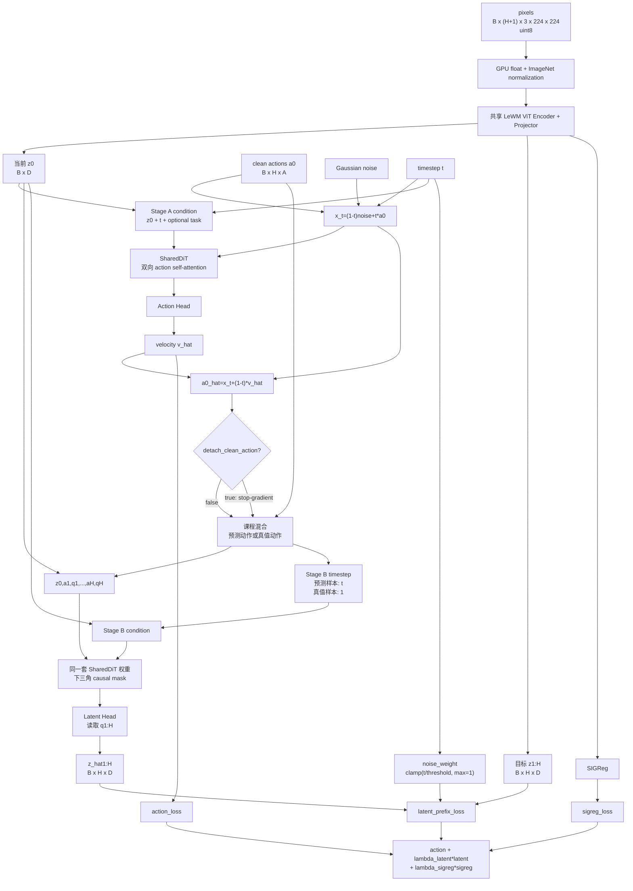
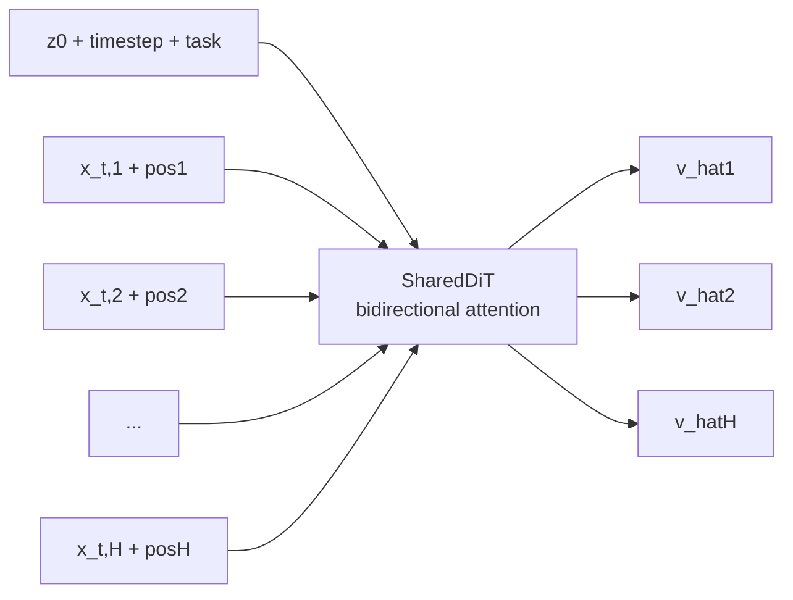
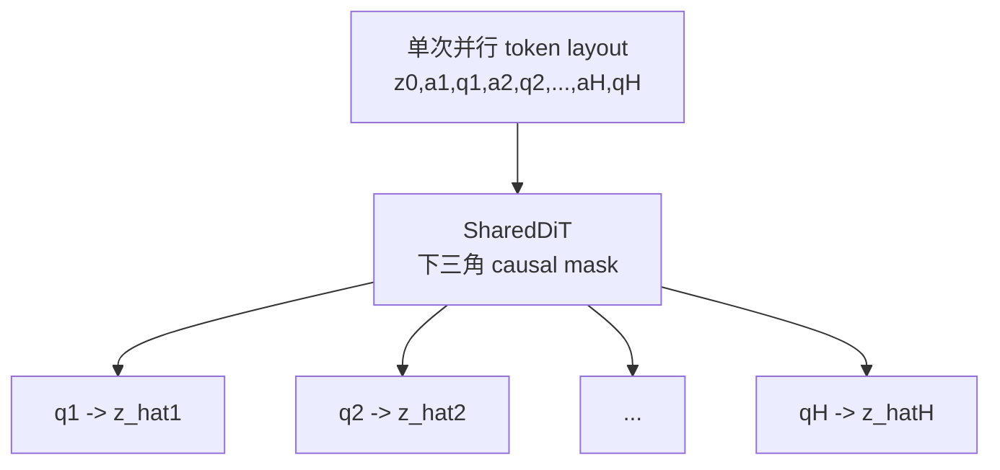
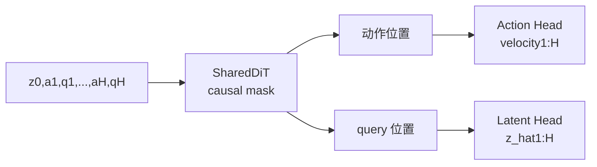
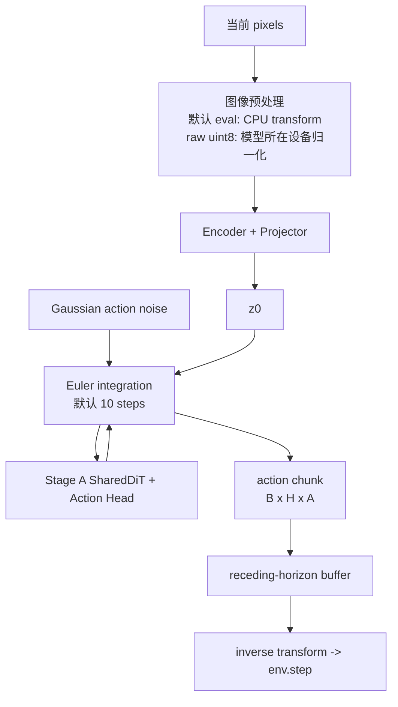
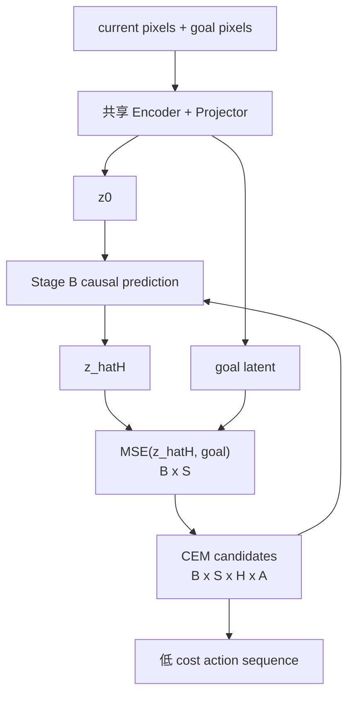

# Fast-LeWAM 模型结构、训练与推理流程图

本文档按当前 `source/model/fast_lewam/`、`source/policy/fast_lewam*.py` 和
`config/train/fast_lewam.yaml` 绘制。Action Block 是 `frameskip` 个环境动作的拼接；
Action Horizon（H）是一次处理的 Action Block 数量，不是原始环境步数。

## 1. 总体训练结构

`FastLeWAM.predictor` 只有一套 `SharedDiT` 权重，Stage A 与 Stage B 以不同 token
布局和 mask 分别调用。latent loss 始终通过 Stage B 调用更新共享 DiT；仅当课程混合
选中预测动作且 `detach_clean_action=false` 时，它才沿 clean estimate 间接回传到
Action Head。真值动作样本没有这条间接路径，其 Stage B timestep 被设为 `1`。

## 2. Stage A：双向 Action DiT

所有动作 token 互相可见，一次并行输出整段 velocity；该调用不创建 latent query，
也不执行 `latent_head`。

## 3. Stage B：并行 causal-prefix latent 预测

| query | 可访问 token | 不可访问 |
| --- | --- | --- |
| `q1` | `z0, a1, q1` | `a2:qH` |
| `q2` | `z0, a1, q1, a2, q2` | `a3:qH` |
| `qk` | `z0, a1, q1, ..., ak, qk` | `a(k+1):qH` |

因此 `qk` 看不到未来动作，并且一次前向并行产生 `z_hat1:H`，没有 autoregressive
latent rollout。当前普通下三角 mask 也允许 `qk` 访问此前的 query token。

## 4. Stage C 对照模式

Stage C 用一次 causal pass 同时输出动作和 latent，动作位置也受 causal mask 限制，
因此不等价于 Stage A+B。`mode="stage_c"` 推理时，`sample_joint()` 每个 Euler step
都会执行动作头和 latent 头（循环只使用 velocity），终点还会额外执行一次 `t=1`
前向读取 endpoint latent；当前环境 policy 最终只使用返回的 actions。

## 5. 默认 Stage A 直接推理

默认 eval transform 在 CPU 完成 float、resize 和归一化；直接传 raw uint8 时，
`encode_pixels()` 才在模型设备归一化。标准 checkpoint 仍实例化并加载完整模型，
但默认 Stage A 执行路径不会构造 Stage B token 或执行 latent head。

## 6. Stage B solver 推理

`StageBModelView` 只向 solver 暴露 `get_cost()`。该路径用于显式 `mode=stage_b`，
不属于默认 Stage A 直接动作推理开销。

## 7. 关键 shape 与默认值

| 名称 | shape / 默认值 | 含义 |
| --- | --- | --- |
| `z0` / `z1:H` | `B x 192` / `B x H x 192` | 当前与未来视觉 latent |
| `action_dim` | `frameskip * env_action_dim` | 一个 Action Block 的维度 |
| `action_horizon` | `5` | 一次处理的 Action Block 数量 |
| `action_velocity` | `B x H x action_dim` | Stage A/C flow velocity |
| `predicted_latents` | `B x H x 192` | Stage B/C latent 输出 |
| `latent_head_layers` / `dim` | `6` / `192` | SharedDiT 深度与 token 维度 |
| `detach_clean_action` | `false` | 允许预测动作样本的间接梯度 |
| `latent_loss_noise_threshold` | `0.2` | latent loss 满权重的 t 阈值 |
| `inference_steps` | `10` | Euler 默认积分步数 |

关键实现位置：`source/model/fast_lewam/jepa.py`、`modules.py`、
`source/policy/fast_lewam.py`、`fast_lewam_eval.py` 和
`config/train/fast_lewam.yaml`。
