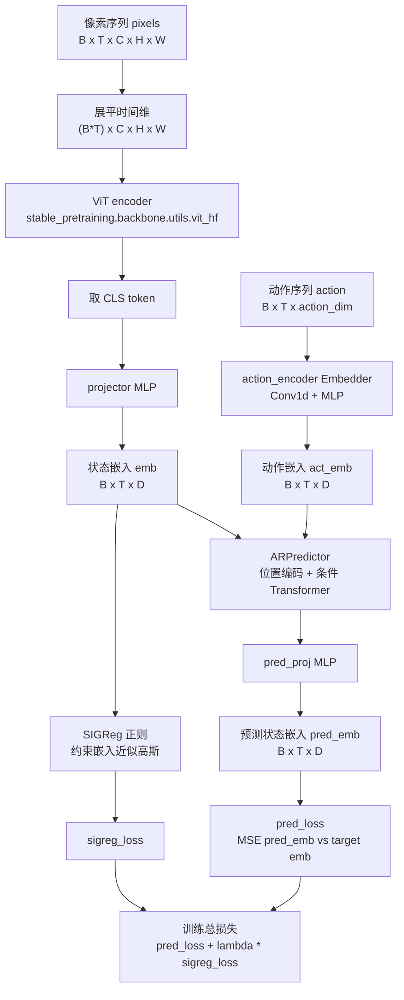
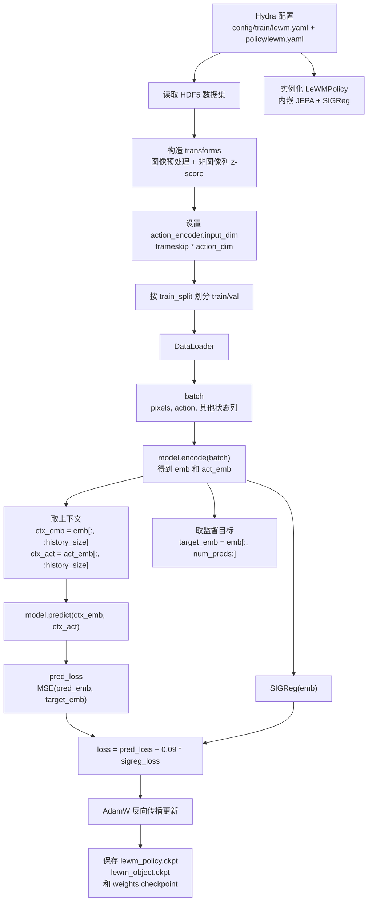
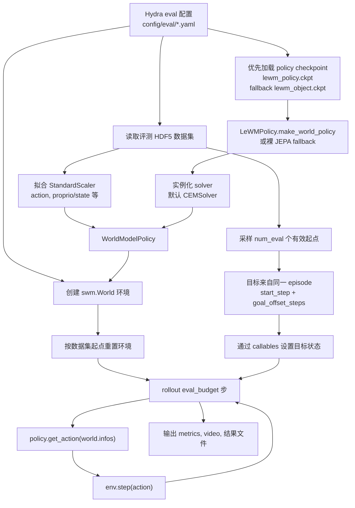
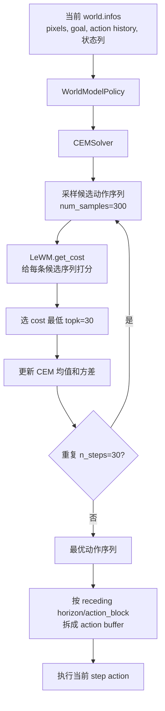
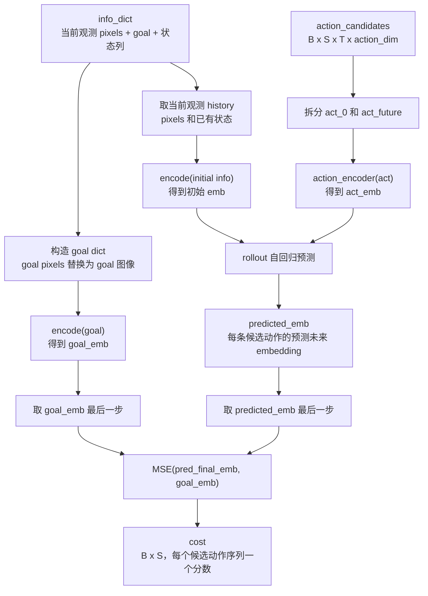

# LeWorldModel 模型、训练和评测流程图

本文档根据当前仓库中的 `source/model/lewm`、`source/policy/lewm.py`、`train.py`、`eval.py` 和 `config/` 配置绘制。图中的 LeWM 指 `source.model.lewm.jepa.JEPA`，训练入口为 `source.policy.lewm.LeWMPolicy`。它在评测阶段不是直接输出 action，而是为候选动作序列输出 cost，再由 planner 选择 action。

## 1. LeWorldModel 模型结构

关键代码位置：

- `source.model.lewm.jepa.JEPA.encode()`：像素编码为 `emb`，动作编码为 `act_emb`。
- `source.model.lewm.jepa.JEPA.predict()`：用 `ARPredictor` 预测下一步 embedding。
- `ARPredictor`：定义在 `source/model/lewm/modules.py`，是带位置编码的条件 Transformer，输入状态 embedding，条件是动作 embedding。
- `source.policy.lewm.LeWMPolicy`：训练入口，复用 `stable_pretraining.spt.Module` 并封装 loss/optimizer/world-policy 构造。
- 默认配置：`wm.history_size=3`，`wm.num_preds=1`，`wm.embed_dim=192`，`loss.sigreg.weight=0.09`。

## 2. 训练流程

训练时 LeWM 学的是 latent dynamics：给定当前若干帧的视觉 embedding 和动作 embedding，预测后续状态 embedding。训练阶段没有 CEM，也不会从模型里直接解码 action。

## 3. 评测和测试流程

评测时的目标不是模型自己产生的，而是 `eval.py` 从数据集中构造的。以 TwoRoom 为例，目标是起点之后 `goal_offset_steps=25` 的 `goal_proprio`，再通过配置里的 `_set_goal_state` 写入环境。

## 4. 从候选动作到真实 action

这里最重要的一点是：LeWM 输出的是每条候选动作序列的 cost，不是直接输出 action。action 的来源是 planner。默认 planner 是 CEM，它在动作空间里反复采样、评分、保留低 cost 样本并更新采样分布，最后把最优动作序列交给 `WorldModelPolicy` 执行。

## 5. LeWM cost 计算细节

`get_cost()` 内部先编码目标，再对每条候选动作序列做 latent rollout，最后用最后一步预测 embedding 和目标 embedding 的 MSE 作为 cost。CEM 只关心这个 cost 的大小，cost 越低表示该候选动作序列越可能到达目标。

默认 eval 配置中：

- `horizon: 5`
- `action_block: 5`
- `eval_budget: 50`
- CEM: `num_samples: 300`，`topk: 30`，`n_steps: 30`

所以一次规划会覆盖 `horizon * action_block = 25` 个环境步，不能超过 `eval_budget`。

## 6. 一句话总结

训练阶段：`LeWMPolicy` 通过 JEPA 学习 `当前视觉 embedding + 动作 embedding -> 下一状态 embedding`。

评测阶段：planner 生成候选动作，LeWM 给候选动作打 cost，planner 选择低 cost 动作序列，环境执行这些动作并统计指标。
