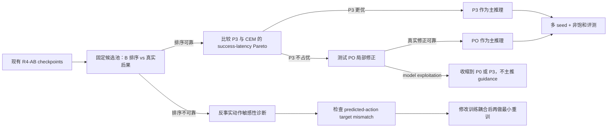

# Fast-LeWAM 面向 CVPR 的深度文献定位、研究计划与实验设计草案

**执行摘要：** 现有工作已覆盖并行动力学、摊销式动作提案、世界模型验证及动作—未来联合建模。Fast-LeWAM 更可守的科学问题，是训练时的动作—动力学耦合能否在固定决策预算下提升“候选排序与真实修正”，而非笼统声称“更快的世界模型”。当前最应优先排查的是估计动作与真实轨迹未来目标不匹配造成的 action-insensitivity 风险。 fileciteturn0file0

**检索截止日期：2026-09-21。** 本报告优先核验论文原文、附录、官方会议页、作者项目页与官方代码；涉及 2026 年论文均按实际查阅的 arXiv 版本标注，不将预印本描述为已被 CVPR 或其他会议接收。项目内部判断主要依据你提供的研究说明、LEDP 设计与预实验文档，以及 Round 5 Phase 1 报告。fileciteturn0file0 fileciteturn0file1 fileciteturn0file2

## 研究定位结论

### 当前假设、前提与已经不能继续采用的假设

你最初的元请求将“研究主题未指定”作为假设，但结合附件，这一假设已经不成立：研究对象已经相当明确——离线视觉目标条件控制，使用共享 DiT 的 A/B 两种模式，A 通过 flow matching 生成 action chunk，B 根据当前 latent 与动作序列并行预测未来 latent；主要候选推理方式为 P0/P1/P2/P3/PO/GF，并且 online training 已明确排除在当前论文主线之外。fileciteturn0file0

仍需要显式保留的前提是：

| 前提 | 本报告采用的处理 |
|---|---|
| 最终投稿 venue 尚未真正锁定 | 按 CVPR 论文对 novelty、视觉问题、机制证据、实验完整性的要求设计，但不给录用概率 |
| 最终主 benchmark 尚未完全锁定 | Reacher 作为当前最重要非饱和诊断任务，Push-T 为次主任务；Cube/TwoRoom 主要做回归检查，除非新增更难/OOD 条件 |
| 训练预算未给定 | 最小实验优先复用 R4-AB checkpoint，只让最关键的因果消融重训 |
| 论文主 inference 尚未确定 | 文献和现有结果暂时更支持把 **P3 或 P0-PO** 作为主候选，再用固定预算实验决胜，而不是预先选定 |
| “joint training 有双向增益”尚未成立 | 当前只能作为待检验假设，不能写成贡献事实 |
| “Fast”尚未构成贡献 | 必须通过 success–latency/Pareto 证据，而不是通过“1 flow step”或少一次模块调用来命名 |
| B 使用预测动作时的监督是否为真实动力学 | **不是。** 当前监督仍是原始离线轨迹的未来 latent，因此不得解释成预测动作的真实 counterfactual consequence |
| GF 与 PO 是否代表两类独立证据 | step=1 时不是；按你的实现，它们退化到高度等价的局部更新，不应作为两个独立机制结果计数 |

最后两点尤其重要，因为它们直接决定论文能声称什么。fileciteturn0file0

### 最关键的文献边界

目前文献已经把几个“看起来像创新点”的方向占得相当满。

**并行 future latent prediction 本身不能作为主要 novelty。** *Fast LeWorldModel* 已经把 LeWorldModel 的逐步 autoregressive rollout 改为 action-prefix encoding 后并行预测多时刻未来 latent，并报告了推理加速与规划结果；其核心思想正好覆盖你 B 模式最容易被审稿人首先联想到的部分。citeturn9view0

**“动作生成器 + 世界模型验证候选”也不是空白。** *LeFlow* 在冻结的 LeWorldModel 上学习 latent flow proposal 和 inverse dynamics，并使用 world-model rollout 对生成候选重新评分；其消融还显示 reranking 在 Reacher 等非饱和任务上很重要，而 TwoRoom/Cube 接近饱和。citeturn10view5turn10view7

**“训练动作与未来预测、推理时可以少做未来想象”已有非常直接的 WAM 先例。** *Fast-WAM: Do World Action Models Need Test-time Future Imagination?* 通过受控变体比较了 video/future co-training 与测试时 future generation 的作用，发现训练阶段的联合 future supervision 本身可以对动作预测产生重要影响。其 setting 是大规模视频 WAM，与 Fast-LeWAM 不同，但它直接压缩了“world model 辅助 action head”作为宏观概念的创新空间。citeturn9view1turn10view0

截至 2026 年，重叠更高的反例是 *$τ_0$-WM: A Unified Video-Action World Model for Robotic Manipulation*：其系统同时涉及 action generation、future prediction、候选 evaluation 和 refinement，因此“统一生成—评估—修正”这一故事本身已经不能作为你的独有定位。它与你最大的差异更多在紧凑 latent JEPA、reward-free goal-conditioned setting、单一共享 DiT 的 A/B mode，以及你能否**严格分解训练耦合的因果作用**。citeturn21view0

另一方面，*Reinforced Planning with Latent World Models* 已明确把“学习评价 imagined outcome 并学习优化计划，以减少昂贵搜索”作为研究目标；虽然它是外挂于 pretrained latent world model 的 learned critic/optimizer，而非你的共享 A/B co-training，但这意味着“减少 CEM 大搜索”也不能单独构成 novelty。citeturn23view0

因此，最危险的 Introduction 版本是：

> “我们首次把 action head 和 world model 放在一起，并通过并行预测和 world-model guidance 实现快速 planning。”

这句话的各个组成部分都已经有非常接近的前例。citeturn9view0turn10view5turn10view0turn21view0

### 候选科学问题

我建议把论文定位理解成五个**研究主题选项**，而不是五套新方法。这同时满足你“收敛科学问题而不是堆模块”的目标。

| 主题选项 | 核心描述 | 具体研究问题 | 初步评价 |
|---|---|---|---|
| **Coupled action–dynamics learning** | 研究动作 proposal 与动作条件 dynamics 的训练耦合是否产生任务互补 | 参数共享本身是否有收益？predicted-action exposure 是否改善 B 对 A 分布的适应？B→A 梯度是否真正改善 A？共享是否导致 gradient interference？ | **最推荐** |
| **Budgeted proposal verification** | 固定决策预算下，能否用 learned proposal + verifier 代替大规模搜索 | B 能否可靠排序 A 候选？P3 相比 CEM 的 success–compute frontier 如何？多少候选足够？ | 很适合作为主 inference 问题，但 novelty 需依赖 coupling |
| **Decision-relevant latent dynamics** | 世界模型是否学到了“对决策有用”的动作后果，而不仅是可解码状态 | 对动作干预是否敏感？动作顺序改变时 B 是否改变预测？latent cost 是否与真实结果排序一致？ | 很强的机制/诊断支柱 |
| **Differentiable action correction** | B 的梯度能否把 A 的动作真正修正到更好的环境结果 | predicted cost 降低是否对应 true cost 降低？PO/GF 何时遭到 model exploitation？梯度方向是否稳定？ | 可成为亮点，但不宜单独宣称新范式 |
| **Efficient shared world-action modeling** | 单一共享模型能否取得更好的成功率—计算—参数 Pareto | 一份参数是否匹配/超过独立 A+B？单环境 latency 与 batch throughput 分别如何？并行 B、P3 和 PO 的关键路径是什么？ | 有价值，但若无明显 Pareto 优势，论文主张偏弱 |

每个主题对应的检索和证据策略也应不同：

| 主题 | 优先证据源 | 检索策略 | 证据判定标准 | 定量/定性输出 |
|---|---|---|---|---|
| Coupled | WAM、MTL、JEPA、world model 原文及代码 | `joint/coupled/unified action future world model shared backbone gradient`；反向搜 τ0-WM/Fast-WAM 引文链 | 必须存在匹配结构对照；“一起训更好”不足以证明耦合机制 | factorized ablation、gradient cosine、A/B 双侧指标 |
| Budgeted verification | LeFlow、MPC、amortized planning、reranking | `proposal verifier latent world model reranking planning budget` | 同候选池、同 latency 或同 model-call budget | success–latency Pareto、selection regret |
| Decision dynamics | LeWM probe、JEPA planning、counterfactual dynamics | `action sensitivity counterfactual world model latent planning probe` | 必须获得真实 simulator branch outcome，而非仅 latent MSE | intervention 曲线、rank correlation、action-order test |
| Correction | gradient planning、diffusion/flow guidance | `gradient action optimization world model guided flow planning` | 预测改善必须与真实执行改善对应 | predicted Δcost vs true Δcost scatter、exploit rate |
| Efficiency | parallel prediction、systems measurement | `parallel latent rollout planning inference latency throughput` | wall-clock、同步、warm-up、硬件/批大小透明 | latency/throughput/peak memory/model-call breakdown |

### 推荐的主科学问题

最推荐的英文版可以写成：

> **Can coupled learning of action proposals and action-conditioned latent dynamics improve proposal verification and correction under a fixed decision budget?**

更完整的中文研究问题是：

> **在固定测试时决策预算下，训练时耦合的动作生成器与动作条件 latent dynamics，能否使同一紧凑模型更可靠地生成、评估并修正自己的动作候选；若能，收益究竟来自参数共享、候选分布对齐，还是跨任务梯度耦合？**

这个问题比目前的“联合学习是否减少大规模搜索”更好，原因有三点。

第一，它没有把“联合”当作答案，而是把 **parameter coupling、distribution/input coupling、gradient coupling** 作为三个需要拆开的自变量。

第二，它把世界模型的价值从“future prediction MSE 更低”转到真正与你推理方式有关的 **candidate ranking / correction reliability**。这与已有 decision-oriented model-learning 思想一致：一个预测模型是否适合控制，并不能仅由状态重建误差决定。*The Value Equivalence Principle for Model-Based Reinforcement Learning* 从 value/reward 视角系统强调了这一点；它与本任务监督不同，但为“预测精度与决策有效性必须分开评价”提供了方法论依据。citeturn18search0

第三，它主动承认一个可能推翻论文故事的反例：你当前向 B 输入 \(\hat a_A\) 时，监督 future 仍是数据轨迹执行 \(a_{\text{data}}\) 的 future。若 \(\hat a_A\neq a_{\text{data}}\)，训练样本在物理意义上相当于

\[
(z_t,\hat a_A)\;\rightarrow\;z_{t+k}^{\,a_{\text{data}}},
\]

而不是

\[
(z_t,\hat a_A)\;\rightarrow\;z_{t+k}^{\,\hat a_A}.
\]

这可能产生一种危险的优化激励：**当输入动作变化但 target 不变时，B 有动力把动作差异视作噪声。** 这只是目前应检验的机制推断，而不是已发生的事实，但它正好会破坏 verifier 所最需要的 counterfactual action sensitivity。fileciteturn0file0

### 哪些是已解决、哪些可能不同、哪些仍不知道

| 判断 | 结论 |
|---|---|
| **已有工作已经解决** | latent goal planning；action-conditioned latent dynamics；parallel multi-step/prefix future prediction；flow/diffusion action proposals；world-model candidate verification；未来预测与动作预测联合训练；测试时 candidate refinement 的一般范式。citeturn3view0turn9view0turn10view5turn10view0turn21view0 |
| **本项目可能存在实质差异** | 单一紧凑 shared DiT 在 A/B 两个 mode 中复用；reward-free visual goal-conditioned control；明确拆分 parameter/input/gradient coupling；用同一个 B 同时支持 ranking 和 local correction；以固定决策预算为中心做因果消融 |
| **目前仍无法判断** | 共享参数是否比两个独立模型更好；predicted-action mixing 是有效 distribution alignment 还是让 B 忽略动作；B→A 梯度有没有稳定正效应；非饱和多 seed 下 P3/PO 是否优于 CEM；是否存在足以称为“Fast”贡献的真实 wall-clock Pareto 优势 |

你的预实验恰好说明为什么不能提前下结论：LEDP 文档中，joint training 对 action head 的增益在 Push-T/Reacher 较明显，但 Cube/TwoRoom 饱和；反向的 action→world-model 增益任务依赖更强，而且串行/并行未来预测在 Push-T 与 Reacher 上甚至方向相反。fileciteturn0file1 Round 5 同样显示 Reacher 是最有区分度的任务：单 seed、50 episode 下 P0 从 72% 到 step-1 GF/PO 的 88%，而 Cube/TwoRoom 大量条件直接饱和；这只能视作下一步机制实验的动机，不足以证明一般性。fileciteturn0file2

### 五个方向的“预期结果摘要”示例

这些文字只是展示未来证据充分后论文应怎样写，**不是当前已经成立的结论**。

**Coupled 示例：**  
在控制模型容量、训练预算与数据后，我们发现共享 action–dynamics backbone 本身只能解释部分收益；进一步让 dynamics 暴露于 policy proposal 分布可提高候选排序，而允许 dynamics loss 经动作路径回传仅在动作敏感性充分的任务上继续改善策略。这表明联合训练的价值并非来自简单多任务正则，而来自特定的 proposal–dynamics coupling。

**Budgeted verification 示例：**  
在相同单步决策延迟下，生成少量候选并由并行 latent dynamics 一次性评分，比随机初始化 CEM 获得更优的成功率—延迟折衷；当候选数继续增加时收益迅速饱和。结果支持 learned proposal 能够减少搜索需求，但并不说明搜索本身不再必要，高困难状态仍可从局部 refinement 中受益。

**Decision dynamics 示例：**  
基础 physical probe 表明多个几何变量均可从 latent 解码，但这种可读性与 planning 表现并不完全一致。对同一初始状态执行反事实动作后，真正决定 candidate ranking 的是模型对动作引起状态变化的敏感性，而非静态位置解码精度。因而我们将表征 probe、动力学干预和决策排序作为三个独立层次报告。

**Differentiable correction 示例：**  
局部 action optimization 通常降低模型预测的 goal cost，但只有在世界模型局部梯度与真实环境结果一致时才提高成功率。困难状态中出现了一部分“predicted cost 改善、真实结果恶化”的 model exploitation 样本，因此我们不把 gradient guidance 视为无条件优于搜索，而把其适用范围与可靠性作为主要诊断对象。

**Efficiency 示例：**  
Fast-LeWAM 的主要计算优势来自减少串行 planner rounds 并批量评估候选，而不是单纯降低 flow integration steps。在单环境低延迟场景中 P3 的纯前向路径最有优势；在大 batch 环境下，CEM 的候选并行度缩小了差距。因而我们同时报告 latency、throughput、model-call 数和 peak memory，而不将常规 kernel 优化包装为算法贡献。

## 分级阅读清单

### P0：必须精读

以下八篇最直接决定论文能不能成立。

| 论文 | 状态与核验 | 为什么必须读 / 必读部分 | 可借鉴实验与关键差异 | 原文 / 官方代码 |
|---|---|---|---|---|
| **LeWorldModel: Stable End-to-End Joint-Embedding Predictive Architecture from Pixels** | 2026，arXiv preprint；查阅 v3，2026-06-03；**全文+附录核验**。citeturn2view0turn3view0 | 你的基础模型；精读方法、planning、§5、Appendix F.1/F.2 | 借 physical probes、CEM protocol；但 LeWM 无 action generator，且 rollout 是主要对照 | Paper: https://arxiv.org/abs/2603.19312 ; Code: https://github.com/lucas-maes/le-wm |
| **Fast LeWorldModel** | 2026，arXiv preprint v1；**全文核验**。citeturn9view0 | 它已经直接解决 action-prefix + parallel future prediction；精读 parallel predictor、multi-horizon loss、self-consistency、runtime tables | 你的 B 必须与它直接对照；不能再把“并行 future”作为核心 novelty | Paper: https://arxiv.org/abs/2606.26217 ; Code: https://github.com/Yuntian-Gao/Fast-LeWorldModel |
| **LeFlow: Generative Latent Flow Planning for World Models** | 2026，arXiv preprint v1，2026-08-25；**全文核验**。citeturn9view2turn10view5 | 与 P3 最接近：proposal、inverse dynamics、world-model verification；精读方法与 reranking/efficiency 消融 | 固定 proposal 数、reranking ablation；关键差异是其 LeWM 冻结、模块化训练，没有你的 shared A/B coupling | Paper: https://arxiv.org/abs/2608.24855 ; Code: https://github.com/hsiangwei0903/LeFlow |
| **Fast-WAM: Do World Action Models Need Test-time Future Imagination?** | 2026，arXiv v2；**全文核验**。citeturn9view1turn10view0 | 它最适合教你怎样把“future training 对 action 的收益”与“future inference 的收益”分开 | 照搬其 controlled-variant 思路；区别是视频生成大模型、MoT/action expert，不是 compact reward-free JEPA | Paper: https://arxiv.org/abs/2603.16666 ; Code: https://github.com/yuantianyuan01/FastWAM |
| **$τ_0$-WM: A Unified Video-Action World Model for Robotic Manipulation** | 2026，arXiv preprint；**方法部分全文核验**。citeturn21view0 | 当前最危险的高层重叠：action generation + future simulation + candidate evaluation/refinement | 必须逐项比较 parameter sharing、action→future interface、scoring、revision；它使用大规模视频/语言/进度监督，不是你的 setting | Paper: https://arxiv.org/abs/2606.01027 ; Project: https://tau0-wm.github.io/；本轮未核实公开代码仓库 |
| **What Drives Success in Physical Planning with Joint-Embedding Predictive World Models?** | 2025/2026 arXiv preprint；**全文核验**。citeturn11academia2turn12view0 | 最适合把“刷成功率”转成“排除解释”：planner、rollout、architecture、proprioception 等因素被系统拆解 | 借 counterfactual physical intervention、planner fairness、CEM/MPPI/gradient optimizer 比较 | Paper: https://arxiv.org/abs/2512.24497 ; Code: https://github.com/facebookresearch/jepa-wms |
| **DINO-WM: World Models on Pre-trained Visual Features enable Zero-shot Planning** | ICML 2025；**官方会议页/主要方法部分核验**。citeturn15search0 | reward-free offline visual latent planning 的强直接基线之一；精读 encoder freezing、latent predictor、goal planning | 能帮助分离“预训练表征收益”与 dynamics 收益；与你端到端 JEPA/共享动作模型不同 | Paper: PMLR ICML 2025；Code: https://github.com/gaoyuezhou/dino_wm |
| **Reinforced Planning with Latent World Models** | 2026，arXiv preprint v1；**摘要/主要方法说明部分核验，未完整复核全部实验细节**。citeturn23view0turn23view2 | 与“学习评价和修正、减少搜索”高度重叠；必须精读 learned critic/optimizer、预算实验 | 对你的 PO/P3 很关键；区别在外挂 pretrained WM 与 imagined-rollout training，而非 shared A/B co-training | Paper: https://arxiv.org/abs/2608.18669；本轮未核实官方代码 |

其中前三篇决定你的架构边界，Fast-WAM 和 \(τ_0\)-WM 决定“联合”的 novelty 边界，*What Drives Success...* 决定实验设计是否有说服力，*Reinforced Planning* 决定“减少 CEM”能否作为主张。

### P1：选择性精读

| 论文 | 状态 | 重点读什么 / 能迁移什么 | 原文/代码 |
|---|---|---|---|
| **Learning from Reward-Free Offline Data: A Case for Planning with Latent Dynamics Models** | NeurIPS 2025 Main Conference；**正式发表，部分核验**。citeturn13academia1turn14search7 | reward-free offline latent planning、数据质量和泛化；适合作为任务 setting 的直接 related work | Project: https://latent-planning.github.io/ |
| **FlowMPC: Improving Flow Matching Policies with World Models** | 2026 arXiv preprint；**摘要/方法概述核验**。citeturn11academia3turn12view2 | flow policy proposal + world model + MPPI；证明“flow action proposal + WM planning”已有直接先例。其 reward/state/MBRL setting 不适合作为公平数值 baseline | Paper: https://arxiv.org/abs/2606.16286 |
| **Faster-WAM: Efficient Inference-Time Future Conditioning for Robust World Action Models** | 2026 arXiv preprint；**部分核验**。citeturn21view1 | SparseMoT / interval future conditioning；帮助界定“测试时保留 future 信息但压缩计算”的现有空间 | arXiv；本轮未核实代码 |
| **Faster-WAM: Do World Action Models Need Deep Action Modules?** | 2026 arXiv preprint；与上篇同名不同论文；**部分核验**。citeturn21view2 | 极浅 action module + video backbone 的效率设计；可帮助区分“参数共享”与“action branch 深度” | arXiv；本轮未核实代码 |
| **Latent Action as Intention Enables Efficient Future Imagination for World Action Models** | 2026 arXiv v2；**部分核验**。citeturn22view3 | 用 latent action/intention 替代显式昂贵 future video 的思路；可作 WAM efficiency 机制参考 | 论文当时说明代码/模型将发布，本轮未确认已发布 |
| **TD-MPC2: Scalable, Robust World Models for Continuous Control** | ICLR 2024；正式发表。citeturn17search1 | policy prior、latent dynamics、local trajectory optimization 如何配合；但它有 reward、online RL，不是公平数值 baseline | Project: https://www.tdmpc2.com/ ; Code: https://github.com/nicklashansen/tdmpc2 |
| **Diffusion Policy: Visuomotor Policy Learning via Action Diffusion** | RSS 2023；正式发表。citeturn16search0 | 必须知道一个不使用 world-model planning 的强 action-generation baseline 能做到什么；避免把 A 的能力归给 B | Code: https://github.com/real-stanford/diffusion_policy |
| **Diffuser: Planning with Diffusion for Flexible Behavior Synthesis** | ICML 2022；正式发表。citeturn16search1 | 生成模型如何吸收 trajectory optimization/guidance；适合作为 amortized planning 与 test-time guidance 背景 | PMLR ICML 2022 |

需要特别注明，2026 年已经出现两篇不同的 **Faster-WAM**，标题和技术路线不同，论文写作中绝不能只写 “Faster-WAM” 而不写完整标题。citeturn21view1turn21view2

### P2：跨领域与方法论参考

| 论文 | 为什么值得读 | 能迁移什么 / 不能声称什么 |
|---|---|---|
| **Gradient Surgery for Multi-Task Learning**，NeurIPS 2020 | shared backbone 多目标训练时的 gradient conflict 与你的 A/B loss 很相似。citeturn17search5 | 可测 A/B gradient cosine、冲突频率，必要时做 PCGrad 诊断；**不能**因为存在两个 loss 就直接宣称负迁移 |
| **Designing and Interpreting Probes with Control Tasks**，EMNLP-IJCNLP 2019 | 讨论 probe 自身学习能力导致的错误解释。citeturn17search0 | random-label/control task、容量控制、selectivity 思想可迁移；不能把 NLP control-task 的具体定义直接套到物理 latent |
| **The Value Equivalence Principle for Model-Based Reinforcement Learning**，NeurIPS 2020 | 强调模型的决策价值与完整状态预测精度并非同一件事。citeturn18search0 | 可用来论证为什么要报告 ranking/regret；它依赖 reward/value 框架，不能直接证明 latent goal distance 是正确价值函数 |

关于你提到的 Mamba、FlashAttention，我建议只借鉴其**论文论证方式**——明确算法结构究竟减少哪类瓶颈，再用硬件测量证实——而不要把它们列为 Fast-LeWAM 的核心 related work，更不要为了“硬件故事”改骨干。

### 优先来源与检索资源

本题不宜机械地“中文优先”。关于 2025–2026 的世界模型、WAM、JEPA 和机器人控制创新边界，最权威的原始资料主要是英文论文与官方代码，因此**证据优先级应高于语言优先级**。正式发表工作优先查 CVF/OpenReview、PMLR、NeurIPS Proceedings、RSS 官方页；新工作再查 arXiv 原版和作者 GitHub。

中文资源的合理角色主要是辅助检索术语、中文综述和国内相关工作：CNKI、万方、国家自然科学基金项目公开信息、高校/实验室官方主页；但不能用中文二手综述证明“没有先例”或支撑 novelty。对于算法发表状态、方法结构和实验设置，应回到原论文/附录/官方代码。

## 最接近工作的对照矩阵

下面这张表应成为你真正写 Related Work 和 rebuttal 前的工作底稿。

| 方法 | 训练监督 / 表征 | Action 与 dynamics 是否共同建模 | Action→future / 梯度耦合 | 时间结构 | 测试时 proposal / scoring / correction | 与 Fast-LeWAM 的最大重叠 | 你必须补什么 |
|---|---|---|---|---|---|---|---|
| **LeWorldModel** | reward-free offline pixel trajectories；JEPA latent | 无 action generator | action 作为 dynamics condition；无 A→B generator path | autoregressive latent rollout | CEM 在 latent terminal goal cost 上规划 | B/world-model 和 benchmark 根基 | baseline protocol、probe、CEM 公平复现。citeturn3view0turn19view1 |
| **Fast LeWorldModel** | 同类 latent JEPA | 无 action head | prefix actions 输入 parallel dynamics | **并行 future prediction** | 仍可用 CEM | 几乎覆盖你“Fast B”的概念 | 必须证明共享 A/B 增加了什么；不能靠并行预测 claim novelty。citeturn9view0 |
| **LeFlow** | frozen LeWM + offline trajectory | proposal 与 WM 分模块 | latent proposal→IDM action；无 shared gradient | proposal 可并行，WM 用于 rollout verify | latent flow proposal + world-model rerank | 与 P3 的 proposer/verifier 结构非常近 | **shared vs frozen modular**、同 N 候选、同 latency 的 P3 对照。citeturn10view5turn10view7 |
| **Fast-WAM** | video diffusion + action flow；大规模 robot/video data | 是，video/action co-training | MoT/shared-attention 式耦合；受控 variant 隔离 future co-training | 视频生成式时间结构 | 主版本测试时可去掉 future generation | “future training 改善 action”的故事高度重叠 | 模仿其 controlled variants，证明不是额外 auxiliary loss/compute。citeturn10view0 |
| **$τ_0$-WM** | 大规模 video/action/language；含 progress/evaluation supervision | 是，系统统一 action/future/evaluation | 高层强耦合，但不等价于你的同权重两-mode A/B | video/action generative | proposal→evaluation→revision | **高层故事最接近** | 必须把 novelty 收缩到 compact reward-free shared DiT + coupling decomposition，而不是“统一 WAM”。citeturn21view0 |
| **Reinforced Planning** | pretrained latent WM + imagined rollout training | planner/critic 外挂 | 不以 A/B shared training 为中心 | learned optimizer | learned evaluator + plan improvement | 与“少搜索、直接学修正”高度重叠 | 证明你的收益来自 co-training/self-verification，而非普通 learned optimizer。citeturn23view0 |
| **FlowMPC** | flow imitation policy + TD-MPC2 WM；reward-based MBRL | policy + WM 组合 | 模块组合，无你的 shared A/B coupling | MPC | flow proposal + MPPI | “flow proposal 可以 warm-start/model-plan”已有 | 只作机制参考，不直接公平比成功率。citeturn12view2 |
| **DINO-WM** | frozen DINOv2 visual features + offline trajectories | 无 action generator | actions condition dynamics | latent rollout | latent goal planning | reward-free visual goal planning直接基线 | 分离视觉表征质量与 shared A/B 学习收益。citeturn15search0 |
| **What Drives Success…** | JEPA-WM 系统研究 | 不是 WAM 主方法 | 系统分析 dynamics/planner | 多种 rollout / planner | CEM、MPPI、gradient optimizer 等 | 直接覆盖你很多“planner 哪个好”的实验问题 | 使用其公平 planner 设计和 counterfactual test，而不是把 PO 说成新范式。citeturn12view0 |

### 最值得警惕的重叠

创新风险从高到低大致是：

**高风险：**

“Action head + future head unified” → Fast-WAM、\(τ_0\)-WM 已明显覆盖。citeturn10view0turn21view0

“Parallel latent future prediction” → Fast LeWorldModel 已直接覆盖。citeturn9view0

“Action proposal + world model reranking” → LeFlow 已直接覆盖。citeturn10view5

“Flow proposal + model-based planning” → FlowMPC 已给出先例。citeturn12view2

“Gradient planner 替代 CEM” → JEPA-WM 系统研究已经比较 gradient optimizers，Reinforced Planning 又进一步学习了 optimizer。citeturn12view0turn23view0

**相对可守：**

你的真正差别可能是：

> **在一个紧凑、reward-free、goal-conditioned 的 latent JEPA 中，用相同共享 DiT 实现 action proposal 与 action-conditioned dynamics，并把 parameter sharing、proposal-distribution exposure 和 cross-task gradient coupling 作为可操纵变量，研究它们是否改善模型对“自己生成的动作”的 verification/correction。**

我没有找到一篇截至检索截止日已经把这一精确问题完整做完的工作；但这应该表述为“检索后未发现精确等价实验设计”，而不是“首次提出 joint action-world model”。支持这个空隙的，是上述几篇最接近工作之间仍存在的监督、参数共享和决策接口差异。citeturn9view0turn10view5turn10view0turn21view0turn23view0

### 关于 “coupled / unified / joint / cascaded” 的命名

**推荐用 “coupled” 描述训练关系。** 更具体地写成：

> **coupled action–dynamics learning with a shared two-mode DiT**

并始终把 coupling 分成：

\[
\text{Coupling}
=
\underbrace{\text{parameter sharing}}_{\text{共享 DiT}}
+
\underbrace{\text{distribution/input coupling}}_{\hat a_A\rightarrow B}
+
\underbrace{\text{gradient coupling}}_{\mathcal L_B\rightarrow\hat a_A\rightarrow A}.
\]

“**joint**” 太宽，并且 WAM 文献经常用它表示 joint video/action generation 或 joint denoising；Fast-WAM 已有 “Joint” variant。citeturn10view0

“**unified**” 适合描述系统，但 \(τ_0\)-WM 已明确用这个词表达统一的 video-action world model；若把它当核心 novelty，容易直接撞车。citeturn21view0

“**cascaded**” 主要暗示 A→B 的前向级联，却掩盖 shared weights 和 B→A gradient，因此不适合作为 R4-AB 的总称。

更精确的论文措辞可以是：

> “A shared two-mode action–dynamics model trained with progressively stronger coupling.”

这样每个结论都能落到具体消融，而不是落到模糊词汇上。

## Coupled / Fast / Probe 设计建议

### Coupled：怎样才能证明“联合训练”而不是“A+B 放一起”

你目前最关键的消融不是再试很多 attention trick，而是做一个**因果分解表**：

| 变体 | A loss | B loss | Shared DiT | B 用 \(\hat a_A\) | B→A gradient | 它隔离什么 |
|---|---:|---:|---:|---:|---:|---|
| A-only | ✓ |  | — |  |  | action baseline |
| B-only |  | ✓ | — |  |  | dynamics baseline |
| Separate A+B | ✓ | ✓ | ✗ | 可选 | 可选/难共享 | “组合有用” vs “共享有用” |
| Shared-GT | ✓ | ✓ | ✓ | ✗ | ✗ | **parameter/multitask sharing** |
| Shared-Pred-Detach | ✓ | ✓ | ✓ | ✓ | ✗ | **proposal-distribution exposure** |
| Shared-Pred-Grad | ✓ | ✓ | ✓ | ✓ | ✓ | **gradient coupling**，即当前完整 R4-AB |

比较关系非常清楚：

\[
\text{Shared-GT}-\text{A-only/B-only}
\]

检测 parameter-sharing/multitask effect；

\[
\text{Shared-Pred-Detach}-\text{Shared-GT}
\]

检测 predicted-action exposure；

\[
\text{Shared-Pred-Grad}-\text{Shared-Pred-Detach}
\]

才检测 B loss 经动作路径回传的边际价值。

而

\[
\text{Shared full}-\text{Separate A+B}
\]

才真正回答“一份 shared DiT 是否比两个模型的组合更值得”。

你的 PDF 第 5–7 页已有 E1–E5 的雏形，但原结果混有任务饱和、单 run、不同机制一起变化的问题，因此非常适合作为此分解实验的 pilot，而不适合作为最终因果证据。fileciteturn0file1

**可以提出的主张：**

> “Training-time coupling improves decision-relevant complementarity between action proposal and latent dynamics.”

**最低证据：** 至少在两个非饱和任务、多 seed 中，Full coupling 相比 Shared-GT/Detach 能改善 A 侧决策指标，且 B 侧至少改善 candidate ranking、counterfactual prediction 或 correction reliability 中一个；训练 compute、参数数、数据保持透明。

**替代解释：** 更大的总训练计算、更强正则、单纯 representation sharing、偶然 seed、benchmark ceiling、predicted-action 输入相当于 data augmentation，而不是“真正双向理解”。

**若实验失败，应收缩为：**

若只有 A 改善：

> “future-prediction auxiliary supervision regularizes action generation.”

若只有 B 改善：

> “policy-generated action exposure improves verification around proposal distribution.”

若性能相同但参数更少：

> “a shared action–dynamics model matches modular systems with lower parameter footprint.”

只有在 A 和 B 两侧各自都有**对相关独立 baseline 的改进**，并且 Full > Detach，才能较强地说“bidirectional coupling”；“一个 joint checkpoint 最终成功率更高”远远不够。

多任务梯度诊断可借鉴 PCGrad 的问题设置：记录 A loss 与 B loss 对 shared blocks 的 gradient cosine、冲突比例及 layer-wise norm；这只能显示 optimization interaction，不能单独证明哪个任务“帮助”另一个。citeturn17search5

### 一个特别需要优先验证的 shortcut

当前 target mismatch 是整个方案里我认为**科学风险最高、但也最能形成好论文诊断**的一点。

对同一 \(z_t\)，如果训练时把多个不同 \(\hat a\) 都配到同一个数据 future \(z_{t+1:t+H}^{a_{\rm data}}\)，模型可能学会：

\[
\frac{\partial B(z_t,a)}{\partial a}\approx 0
\]

至少在 \(\hat a\) 偏离 \(a_{\rm data}\) 的局部方向上如此。

这不会一定发生；A 本身若已经非常接近专家动作，mismatch 很小。但这正是为什么不能仅看 B prediction loss——一个**对动作不敏感的 B 也可能在行为数据分布上得到低 loss，却是糟糕的 planner/verifier**。

建议加三个简单量：

\[
S_{\rm action}
=
\mathbb E
\frac{\|B(z,a_i)-B(z,a_j)\|}
{\|a_i-a_j\|+\epsilon},
\]

配合 simulator 中真实的

\[
S_{\rm true}
=
\mathbb E
\frac{\|z^{\rm true}(a_i)-z^{\rm true}(a_j)\|}
{\|a_i-a_j\|+\epsilon},
\]

以及**action-shuffle degradation**：把动作序列在 batch 内打乱后，如果 B 的 prediction/ranking 几乎不变，则说明 action conditioning 可能没有真正被使用。

### Fast：把“速度”变成可信贡献

目前“Fast”最安全的定义不是 flow step 少，而是：

> **在给定成功率下需要更少的串行决策计算，或在给定端到端决策延迟下取得更高成功率。**

*Fast LeWorldModel* 已经明确把 autoregressive rollout 的串行依赖改成 prefix + parallel prediction，并报告 dynamics 与 planning runtime，因此你的效率比较至少要达到相似的严谨度。citeturn9view0

必须分开报告以下计算来源：

| 成本维度 | P0 | P1 CEM | P2 warm-start CEM | P3 rerank | PO | GF |
|---|---:|---:|---:|---:|---:|---:|
| A forward | 少 | 0 | ≥1 | N 或 batched sampling | ≥1 | flow 每步 |
| B forward | 0 | candidates×iters | candidates×iters | N，可 batch | 每优化步 | guidance steps |
| B backward | 0 | 0 | 0 | 0 | ✓ | ✓ |
| 串行 rounds | flow steps | CEM iters | flow+CEM | 很少 | opt steps | flow steps |
| 候选 batch 并行性 | 高 | 中/高 | 中/高 | **高** | 低 | 较低 |
| peak activation memory | 低 | 中 | 中 | 取决于 N | **高** | **高** |

**算法贡献**可以是：消除 autoregressive dependence、减少 search rounds、用 learned proposal 改变搜索分布、并行 candidate scoring。

**常规实现优化**包括：PyTorch compile、kernel fusion、CUDA graphs、更好的 memory layout、减少 Python overhead。除非你的算法专门为 memory access / kernel structure 重新设计并有系统 profiling，否则不应该说成“hardware–algorithm co-design”。

### 公平效率 benchmark

最低报告：

**端到端 single-environment control latency：** p50 / p90，而不仅是平均值。

**multi-environment throughput：** decisions/s，独立于单环境 latency。

**模型工作量：** A forward、B forward、B backward、flow vector-field evaluations、CEM candidates、iterations。

**显存：** peak allocated memory。

**硬件条件：** GPU 型号、precision、batch size、PyTorch/CUDA 版本、warm-up 数、同步方式。

**质量—成本联合指标：**
1. same latency 比 success；
2. same success 比最低 latency；
3. 完整 success–latency Pareto curve。

P3 的优势很可能来自“纯 forward + candidate batching”；PO/GF 需要反向传播和串行迭代，因此不能用“相同优化迭代数”公平比较。最可信的主横轴是**实测 wall-clock latency**，model calls 作为解释性横轴。

此外，你已经明确发现 step-1 GF 与 PO 在当前实现下机制退化，应把它们在 step=1 合并解释，不能在论文图里画成两项“相互验证”。fileciteturn0file0 Round 5 中它们在 Reacher 多个条件表现一致，也进一步说明这个实现事实不能被包装为两条独立证据。fileciteturn0file2

**如果最终 P3 在相同 latency 下不能胜 CEM，Fast 主张应该收缩**到“shared architecture / parallel verification”，不要勉强说 planner 更快。

### Probe：先准确还原 LeWorldModel

LeWorldModel §5 与 Appendix F.2 做的是**表征可读性 probe**，不是你的 dynamics/counterfactual probe。正文报告了 linear/nonlinear probing，并在 Push-T 上检查 agent position、block position、block angle 等物理量；附录扩展到 TwoRoom 和 Cube，并报告 MSE 与 Pearson correlation。citeturn19view0turn19view1

Cube 的附录表格事实上不仅包含位置，还包括 joint position、joint velocity、end-effector position/yaw、gripper、block position/quaternion/yaw 等标签；这对你尤其有价值，因为它显示“静态几何位置可读”与“动态变量/旋转状态可读”可以是完全不同的结果。citeturn19view1

但原文没有把 probe 实现写到足够复现的程度：

| LeWorldModel probe 项 | 能从论文核实 | 当前不能核实 |
|---|---|---|
| 输入 | learned latent embedding / encoder representation | 精确 extraction point、归一化前后、token pooling 细节 |
| 标签 | TwoRoom 位置；Push-T agent/block position + block angle；Cube 多类 joint/EE/block 状态 | 某些 label 的精确预处理/尺度 |
| probe | linear + nonlinear | nonlinear MLP 层数、宽度、activation 等具体结构 |
| backbone | 论文意图是对 learned embedding 做 probing | 附录未明确写出 freeze 实现细节 |
| split | 未充分说明 | 是否按 trajectory/scene 分组，具体 train/val/test |
| 训练预算 | 未充分说明 | epoch、optimizer、LR、batch、early stopping |
| 指标 | MSE、Pearson \(r\) | label normalization 对 MSE 的具体影响 |

官方 LeWM main repository 当前公开树包含 train/eval/JEPA/model/config 等文件，但截至本轮检查没有发现单独的 physical probe 实现脚本，因此上述缺失细节不能从官方代码补齐；应在论文复现里明确写“we implement the probes following the reported task/metrics, since the original probe training details are not fully specified”，而不是臆造设置。fileciteturn4file0L1-L10

这一点也说明：你的 probe 设计最好比 LeWM **更可复现**。

### 推荐的三个 probe / diagnostic

#### 基础物理 probe：Frozen Physical Readout

**假设：** shared A/B training 是否改变 latent 对控制相关物理变量的可访问性。

**输入：**
- encoder \(z_t\)；
- A 的中间 hidden；
- B 在 current/action token 上的 hidden；
- B predicted future latent \(\hat z_{t+k}\)。

这些位置应该分开报告，因为它们回答不同问题：encoder probe 表示“观测中有什么”；A hidden 表示 action generation 计算过程保留了什么；B hidden 表示 dynamics computation 保留了什么；predicted latent probe 才更接近“预测未来是什么”。

**标签：** Reacher 的 joint angle / end-effector position；速度只在带 history 的输入上正式报告。Push-T 的 agent、block position 和 block orientation；Cube 的 EE/block position + orientation。角度建议用 \((\sin\theta,\cos\theta)\) 或 rotation-aware error，而非裸角度 MSE。

**对照：** random encoder、random labels、matched-capacity random projection、linear ridge vs 固定小 MLP、历史长度 \(1\) vs \(>1\)。

**划分：** 必须 trajectory-level / scene-level split，不能随机按帧切分，否则相邻帧泄漏会让结果过于乐观。

**指标：** \(R^2\)、Pearson \(r\)、normalized RMSE；原始 MSE 可为兼容 LeWM 同时报告。

**成本：** 很低；冻结已有 checkpoint 后抽 features 即可。

**能够支持：** “某物理量在该 representation 中可读”。

**反证：** random encoder 或高容量 probe 达到接近结果；不同训练变体 probe 相同却决策差异明显。

**不能支持：** “模型在决策时实际使用了这个信息”。Hewitt & Liang 对 probes 的核心方法论警告正是：probe 的预测能力可能来自 probe 本身，因此需要 control tasks 与容量控制。citeturn17search0

特别是**单帧 velocity**：若任务观测中没有使速度可辨识的动态线索，probe 解不出来可能是 observability 限制，而不是 representation 失败；必须比较单帧与历史观测。

#### 动力学诊断：Counterfactual Action Sensitivity

**假设：** B 不只是能预测行为数据轨迹，而是能区分“同一当前状态下不同动作导致的不同真实后果”。

从 simulator 保存同一个 initial state，构造动作：
- 数据动作；
- A proposal；
- 小扰动 \(a+\delta\)；
- 动作顺序 permutation；
- null/zero action；
- 必要时随机动作。

分别实际 branch execution 得到真实 \(o_{t+k}^{(a)}\)，经同一个 encoder 得到 \(z_{\rm true}^{(a)}\)，与

\[
\hat z^{(a)}=B(z_t,a)
\]

比较。

**指标：**
- future physical-state error；
- future latent error；
- action-pair distance correlation；
- predicted goal progress 与 true goal progress 的 Spearman；
- action-order swap sensitivity；
- null/shuffled-action degradation。

**关键控制：** 同 initial state 配对；同 action magnitude；固定 horizon；Separate B / Shared-GT / Detach / Full 全部用同 intervention set。

**成本：** 不重训，只需 simulator branch execution。

**能够支持：** “B 在动作方向上具备 counterfactual discrimination”。

**反证：** 改动作后 B 几乎不变；或 B 对动作很敏感但变化方向与真实 dynamics 无相关性。

**局限：** simulator branch evaluation 使用了额外 privileged state，但它只进入**诊断**，不进入主方法训练，因此不构成特权信息泄漏。

这个测试比 LeWM 的静态 probe 更强，因为正文 probe 证明的是 representation 内存在某些物理变量，而不是给定干预动作后能预测正确结果。citeturn19view0turn19view1 *What Drives Success...* 中的物理动作干预也说明这种 counterfactual inspection 对 JEPA planning 很有诊断价值。citeturn12view0

#### 决策诊断：Fixed-Pool Ranking & True Correction

这是最应该直接挂到主推理方法上的实验。

对每个 initial state 预先固定一个候选池：

\[
\mathcal A=\{a^{(1)},...,a^{(N)}\},
\]

候选来自 A 的多个 samples，并可加入与 A 候选相同幅度的局部 perturbations。所有 checkpoint、所有 scoring 方法用**完全相同候选池**。

B 给出预测 cost：

\[
\hat c_i=d\!\left(B(z_t,a^{(i)}), z_g\right),
\]

同时 simulator branch execution 给出真实后果，从而得到真实 cost \(c_i^{\rm true}\)。

报告：
- Spearman \(\rho\) / Kendall \(\tau\)；
- pairwise ranking accuracy；
- top-k recall；
- selection regret

\[
R=
c_{\text{selected}}^{\rm true}
-
\min_i c_i^{\rm true};
\]

- 如果执行 PO，再报告

\[
\Delta\hat c
=
\hat c(a_{\rm after})-\hat c(a_{\rm before}),
\]

与

\[
\Delta c_{\rm true}
=
c_{\rm true}(a_{\rm after})-c_{\rm true}(a_{\rm before})
\]

的相关性，以及 **predicted improvement but true degradation rate**。

**假设：** full coupling 的 B 对自己 A 生成的候选排序更准确，同时其梯度更可能产生真实改善。

**支持结论：** Full > Detach > Shared-GT 的 ranking/regret，并对应更优 P3/PO success。

**反证：** B prediction MSE 更低但 ranking 不升；PO 总能降 latent cost，却使真实 outcome 变差。这会直接揭示 model exploitation。

**成本：** 中低；不需要重训，首先就可以在 R4-AB 上做。

如果只能选三个 probe，我建议就是这三个，且优先级为：**决策排序 > counterfactual dynamics > static physical readout**。理由是前两个真正检验你的论文机制，static probe 主要服务解释和与 LeWM 对齐。

## 下一轮最小实验计划

### 当前结果应如何解读

LEDP 预实验中，A-only vs joint 在 Push-T 和 Reacher 分别出现约 +6/+8 个百分点，而 world-model-only vs joint 在任务间差异更大；这至多提示“两个方向可能有 interaction”，无法把它升级为双向增强，因为已有结果混入参数共享、多任务训练、predicted-action mixing、gradient path 等多个变量。fileciteturn0file1

Round 5 则给了一个更有价值的信号：**Reacher 对 world-model-guided correction 非常敏感，而 Cube/TwoRoom 太容易饱和。** 例如同一 seed 的 step-1 Reacher 中，P0 72%，P0+GF/PO 88%；P3 74%，P3+GF/PO 92%。配对统计显示部分比较显著，但报告自己也明确指出只有单 checkpoint、单训练 seed、50 episodes，不能外推成最终结论。fileciteturn0file2

LeFlow 的独立实验也因 TwoRoom/Cube 已接近饱和而把很多 reranking 分析聚焦到 Reacher 等更有区分度的任务，这进一步支持你不要继续把 100% 成功率当主要论文证据。citeturn10view7

### 最多六个实验包

| 优先级 | 实验包 | 是否重训 | 具体内容 | 决定哪个论文问题 |
|---|---|---|---|---|
| **最高** | **Fixed candidate ranking + PO true-outcome audit** | 不重训 | Reacher/Push-T 固定 A candidates；B 预测排序 vs simulator 真后果；PO 前后 predicted/true improvement | B 到底是不是有效 verifier/corrector |
| **最高** | **Counterfactual action sensitivity** | 不重训 | 同 state 分支执行 GT/A/perturbed/permuted/null actions；测 B action sensitivity 与真实变化 | 当前 predicted-action target mismatch 是否让 B 忽略动作 |
| **最高** | **Coupling factorization** | 少量重训 | A-only、B-only、Separate A+B、Shared-GT、Pred-Detach、Pred-Grad；至少 3 seeds 只跑 Reacher+Push-T finalist | parameter / input / gradient coupling 谁真正有效 |
| **高** | **Success–compute frontier** | 不重训 | P0/P1/P2/P3/P0-PO；GF 只在 >1 step 作为独立方法；同 latency、同 B-call、不同 N/iterations | “Fast”能否成立、主 inference 应选谁 |
| **中** | **Physical representation probes** | 不重训；只训练 probe | z/A hidden/B hidden/predicted z；trajectory split、linear+MLP+controls | 解释 representation 变化，但不抢主故事 |
| **高，最后执行** | **非饱和协议 + finalist multi-seed** | 先仅 eval；必要时重训 finalists | 更远目标、困难 starts、较长 horizon/OOD goal；扩 episodes；只对两三个 finalists 重训 | 防止 ceiling effect；决定主表能否有统计说服力 |

这里刻意没有建议遍历所有 backbone、loss、planner 的笛卡尔积。你的第二轮实验已经显示 model_dim、token semantic、attention 等很多 trick 只改变早期收敛或呈任务依赖，再继续大范围搜索的科学回报很低。fileciteturn0file1

### 主推理方式的决策标准

现阶段不建议凭当前 success 直接指定主方法。用以下决策树更稳妥：

我的先验排序是：

**P3 最适合作为第一主候选。** 它与研究问题最一致：A 提 proposal，B 做 verifier；纯前向、候选可 batching，最容易形成清晰的 success–compute 故事。但 LeFlow 已经是强先例，因此 novelty 必须来自 shared co-training / coupling，而不是 reranking 本身。citeturn10view5

**P0-PO 是第二主候选。** 它最能测试“B 是否可以修正 A”，也最容易做真实 consequence diagnostic；但 gradient planning 并非新机制，且存在 model exploitation 风险。citeturn12view0turn23view0

**P2 最适合保留为强 baseline。** 它回答 learned proposal 是否只是给传统 CEM 一个好的 warm start。

**P1** 是经典随机初始化 search reference。

**GF** 只有当多步生成中它表现出 PO 无法解释的轨迹级行为时才值得独立讨论；step=1 不应重复计数。fileciteturn0file0

### 统计与评测协议

最终论文不要再只报告“每方法 50 episodes 的单一成功率”。建议：

- 同一个 initial-state/goal cohort 做 paired evaluation；
- binary success 同时报告 Wilson/Bootstrap CI，并可用 paired McNemar；
- ranking/regret 以 initial state 为独立单位 bootstrap，不能把同一状态下 N 个 candidates 当 N 个独立样本；
- 关键 finalists 至少多 training seeds；
- success、ranking、latency 三类指标分开报告，不要把所有证据折成一个平均分。

Round 5 已经采用同 cohort episode identity 的 paired 比较，这是值得保留的评测设计；但其单 seed 限制必须继续明确。fileciteturn0file2

### 可调整交付物与时间预算

最终研究交付建议固定为：执行摘要、完整 related-work matrix、主科学问题与 claim table、实验协议、图表/数据表、参考文献与版本记录、可复现实验清单。

| 时间预算 | 里程碑 | 可交付成果 |
|---|---|---|
| **一周** | 第 1–2 天精读 P0 前五篇；第 3–4 天跑 ranking/counterfactual；第 5–7 天完成 compute profile | 一页定位、近邻矩阵 v1、主 inference 初选、三个诊断图、是否值得做 coupling 重训的 go/no-go |
| **三周** | 第 1 周完成上述诊断；第 2 周完成 6-way coupling factorization；第 3 周完成 latency Pareto 与基础 probes | 可写入论文的 Coupled/Fast/Probe 三组核心图表、P0/P1 related work、Introduction v1 |
| **八周** | 前 3 周同上；第 4–5 周非饱和 benchmark 与多 seed；第 6 周 profiler/统计；第 7–8 周论文整合和补缺 | 完整主表、机制消融、效率曲线、三层 probe、统计附件、supplement、正式参考文献与代码配置记录 |

### 主要风险与缓解

| 风险 | 为什么严重 | 缓解 |
|---|---|---|
| **benchmark saturation** | Cube/TwoRoom 大量 100%，任何新机制都无法区分 | Reacher/Push-T 主分析，增加困难 goal/start/horizon |
| **target mismatch 导致 action ignoring** | 直接破坏 B 的 verifier 价值 | action-shuffle、counterfactual branch、Pred-GT/Detach/Grad 消融 |
| **共享模型收益只是额外训练计算** | 无法证明 complementarity | Separate A+B、matched steps、明确 FLOPs/epochs |
| **gradient negative transfer** | A/B 可能互相伤害 | layer-wise gradient cosine、Detach control、必要时 PCGrad 仅作诊断。citeturn17search5 |
| **model exploitation** | latent cost 降而真实表现恶化 | PO 前后真实 simulator branch、exploit rate |
| **latent metric 不等于 controllability** | Euclidean latent goal distance 可能偏离可达性/控制价值 | ranking/regret 与真实 outcome；不要只报 latent MSE |
| **offline candidate distribution shift** | A/PO/CEM 可能产生行为数据外动作 | 按 action-distance-to-dataset 分层报告 dynamics/ranking |
| **protocol/version 漂移** | 你的 LeWM 复现审计已经发现论文、上游代码、权重配置之间存在历史差异 | 每张表冻结 config/commit/版本；不混用不同 eval protocol。fileciteturn0file1 |
| **“Fast”实际来自 batching/实现** | 算法贡献会被质疑 | 同硬件 microbenchmark，分模型调用与 wall-clock，明确 systems optimizations |
| **过度解读 probe** | 可读性被误写成模型使用了信息 | random controls + decision diagnostics；静态 probe 不单独支撑机制。citeturn17search0 |

## Introduction 论证骨架

### 问题：直接策略快，但显式评估动作后果通常需要规划

第一段可以从一个非常具体的 tension 开始：

> Visual goal-conditioned control requires both fast action generation and the ability to reason about the consequences of candidate actions. Direct generative policies amortize control into action prediction, while latent world models support explicit goal-directed planning but typically require repeated model evaluations or trajectory optimization.

这里引用 **Diffusion Policy** 代表强 direct action generation，引用 **DINO-WM、PLDM、LeWorldModel** 代表 reward-free/offline latent planning。citeturn16search0turn15search0turn14search7turn3view0

不要说“direct policy 完全不能推理”，也不要说“world model planning 一定很慢”；准确表达是两类方法在测试时决策计算结构不同。

### 现有方法边界：已有工作已经在缩短 rollout、摊销 proposal、融合 action/future

第二段必须主动把最接近工作放前面，而不是隐藏：

> Recent work has attacked this trade-off from multiple directions. Fast LeWorldModel parallelizes latent future prediction; LeFlow amortizes planning with generative latent proposals and verifies them with a world model; Fast-WAM studies when future modeling is needed during training versus inference; and recent unified WAMs couple action generation with future simulation and refinement.

分别引用 Fast-LeWM、LeFlow、Fast-WAM、\(τ_0\)-WM。citeturn9view0turn10view5turn10view0turn21view0

然后提出**尚未被精确回答的问题**，而不是“这些方法都不行”：

> What remains unclear in compact reward-free latent control is whether *training-time coupling itself* makes an action generator and an action-conditioned dynamics model better partners at inference, or whether comparable gains can be obtained by simply combining separately trained modules.

这是目前最有价值的 gap。

### 研究假设：耦合可能帮助，也可能伤害

第三段不要写成已经证明：

> We hypothesize that a shared model can benefit from three forms of coupling: shared representations, exposure of the dynamics model to policy-generated actions, and gradients from future prediction back to action generation. However, these mechanisms may also induce negative transfer or reduce action sensitivity when generated actions are paired with futures from the original behavior trajectory.

这段特别重要，因为它把你的 target mismatch 从“实现瑕疵”升级成**明确的、可反证的科学风险**。项目本身已经明确该 future target 并不是生成动作的真实 consequence，因此这里必须用 hypothesis/could，而不能写成“B learns the outcome of its own actions”。fileciteturn0file0

### 方法：共享 two-mode DiT，而不是堆很多 mode

第四段只介绍 A/B：

> Fast-LeWAM uses a shared DiT in two modes. The action mode generates goal-conditioned action chunks with flow matching. The dynamics mode predicts multiple future latents in parallel under an action-causal mask. We progressively couple these modes through shared parameters, generated-action inputs, and cross-mode gradients.

不要把 inverse dynamics、latent planner、online learning 等历史探索重新加成主模块。你自己的研究说明已经正确地把它们排除在主方法之外。fileciteturn0file0

推理部分则写：

> This representation supports direct execution, proposal-and-ranking, and local differentiable correction, allowing us to study decision quality under a controlled inference budget.

不要在 Intro 中把 P0/P1/P2/P3/GF 全部列成“方法贡献”。

### 待验证贡献：把 claim 写成条件句

最后一段贡献最好暂时用**待验证**措辞：

> We investigate whether coupled training improves both action generation and decision-relevant dynamics beyond parameter sharing alone.

> We evaluate whether the learned dynamics can correctly rank and locally improve policy-generated candidates using simulator-grounded counterfactual diagnostics.

> We characterize the success–compute frontier of direct execution, search, reranking, and gradient-based correction under matched inference budgets.

只有实验完成后，才把 “investigate/evaluate” 改成 “show/demonstrate”。

### 什么证据对应什么强度的措辞

| 最终结果 | 可以说 | 不应说 |
|---|---|---|
| Joint 只提高 A success | “future-prediction auxiliary training improves action generation” | “bidirectional world-action enhancement” |
| B ranking 提高，A 不变 | “proposal-distribution coupling improves verification” | “action and world model mutually enhance each other” |
| Full > Detach 且 A/B 双侧都升 | “gradient coupling contributes to bidirectional improvement” | “learns true consequences of its own actions”，除非 target 问题被解决 |
| P3 同 latency 优于 CEM | “better success–compute frontier / reduced search requirement” | “planning-free” |
| PO 降 predicted + true cost | “local differentiable correction is effective in tested regime” | “gradient planning universally replaces CEM” |
| 只减少参数但成功相当 | “parameter-efficient shared action–dynamics model” | “better planner” |
| 只有 static probe 改善 | “greater physical information accessibility” | “better physical reasoning” |

## 阅读路线

### 第一篇：LeWorldModel

先精读 **§5 + Appendix F.2，再回方法和 planning**，而不是按顺序从 Introduction 开始。正文 probe 只说明 latent 对部分物理量具有可读性；附录 Cube 结果尤其值得注意，因为位置类量和 joint velocity/rotation 类量的 probe 表现差异明显。citeturn19view0turn19view1

读完后必须做出的决定是：

> **Fast-LeWAM 的 probe 是否要仅复现 LeWM，还是升级成 decision-level diagnostics？**

答案应该是后者。LeWM probe 可作为基础层，不能承担你论文最重要的机制证据。

同时冻结官方 eval protocol 和代码 commit。你自己的 PDF 已经发现不同论文/代码/权重口径之间存在过配置差异，因此这一步是实验可信度的前置条件。fileciteturn0file1

### 第二篇：Fast LeWorldModel

精读 action prefix encoder、parallel future prediction、multi-horizon loss、自一致性变体、runtime 实验。其核心贡献已经说明“动作前缀 + 并行 future latent”不是 Fast-LeWAM 可以单独占据的创新。citeturn9view0

读完后必须做出决定：

> **把 B 的“parallel future prediction”降级为基础组件，还是你确实有一个与 Fast-LeWM 实质不同、经过实验验证的 causal attention/predictor 机制？**

在目前证据下，我建议降级为基础组件，把 novelty 转向 shared A/B coupling。

### 第三篇：LeFlow

精读 proposal、inverse dynamics、rollout verification、reranking ablation 和 Reacher/Push-T 分析。LeFlow 已经证明“生成候选后用 world model 选优”是直接可行的结构，所以 P3 本身不能再包装为主要算法发明。citeturn10view5turn10view7

读完后必须做出决定：

> **P3 的科学价值究竟是一个新 planner，还是一个测量 coupled training 是否产生更好 self-verification 的实验接口？**

应该选后者。

### 第四篇：$τ_0$-WM

这是当前最应该“带着敌意”读的一篇。逐项检查 action generation、future simulation、candidate evaluation、revision、共享 backbone 与监督形式。它表明 unified action/future/evaluation 的宏观故事已经有人占据。citeturn21view0

读完后必须做出决定：

> **如果 reviewer 说“这就是小型 latent 版 unified WAM”，你的不可替代回答是什么？**

一个合格回答必须是实验性的，而非措辞性的：

> “我们的研究对象不是再提出一个 unified WAM，而是通过受控 factorization 研究 proposal–dynamics coupling 的因果作用，并以真实 counterfactual ranking/correction 和固定 inference budget 为评价。”

若你做不出这套证据，论文的 novelty 风险仍然较高。

### 第五篇：What Drives Success in Physical Planning with Joint-Embedding Predictive World Models?

这篇不是最像你架构的，却最能提升实验质量。重点看不同 planner、公平计算预算、multistep prediction 和物理行为诊断。citeturn12view0

读完后必须做出决定：

> **哪些结果是在证明 Fast-LeWAM，哪些只是证明某个 optimizer/benchmark protocol 更好？**

然后冻结 planner comparison protocol，不再根据每个任务单独调出最有利于自己方法的搜索预算。

### 实际阅读顺序与研究决策总表

| 顺序 | 论文 | 读完必须回答 |
|---|---|---|
| **先读** | LeWorldModel | 原始 probe 证明了什么、没证明什么？官方协议到底是什么？ |
| **第二** | Fast LeWorldModel | “parallel B”还剩多少 novelty？ |
| **第三** | LeFlow | P3 是否只是已有 reranking？共享 co-training 能否成为真正差异？ |
| **第四** | \(τ_0\)-WM | “unified WAM”高层故事还能不能使用？你的精确 gap 是什么？ |
| **第五** | What Drives Success… | 主表必须排除哪些 planner/representation/compute 替代解释？ |

随后立即读 **Fast-WAM**，用它来重写 coupling ablation；再读 **Reinforced Planning**，检查 PO/learned correction 的 novelty 边界。citeturn10view0turn23view0

最终研究路径应收敛成一条，而不是三个并列故事：

\[
\boxed{
\text{Coupled Training}
\rightarrow
\text{Decision-Relevant Dynamics}
\rightarrow
\text{Reliable Proposal Verification/Correction}
\rightarrow
\text{Better Success–Compute Frontier}
}
\]

其中每个箭头都必须有独立实验支持。**Probe 负责验证第二个箭头，P3/PO 的真实后果诊断负责第三个箭头，公平 latency benchmark 负责最后一个箭头。** “共享 DiT”“并行 future”“flow policy”“gradient guidance”都只是完成这条证据链的技术手段，而不是各自独立的论文贡献。

以现有文献和预实验为依据，最值得立刻停止的三件事也很清楚：不要继续围绕“首次统一 action 与 world model”写故事，不要把低 flow step 当科学结论，不要在 TwoRoom/Cube 的 100% 成功率上继续堆 planner trick。最值得立即执行的则是三个无需重新训练的实验：**固定候选真实排序、counterfactual action sensitivity、PO 的 predicted-vs-true correction audit**。它们最快能够回答 Fast-LeWAM 到底是在学一个真正有决策价值的 coupled world-action model，还是目前的成功率主要来自强 action prior 与 benchmark ceiling。fileciteturn0file0 fileciteturn0file2