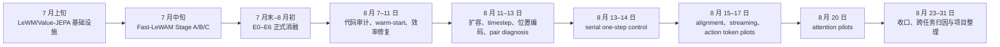
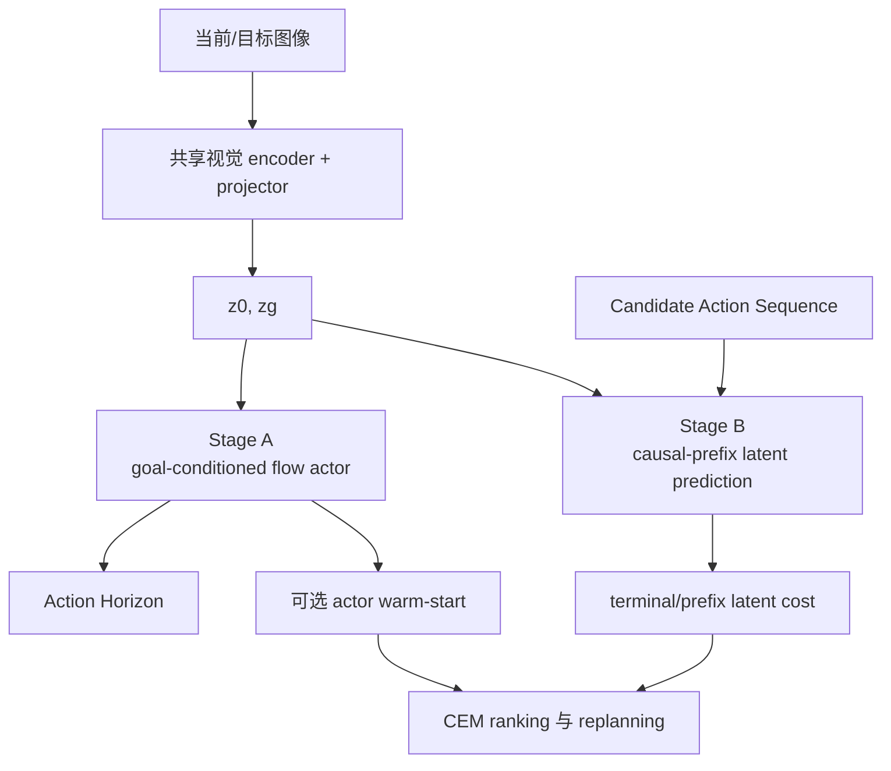

# Fast-LeWAM：2026 年 7–8 月项目总报告

> 统计区间：2026-07 至 2026-08
>
> 汇总截止：2026-08-31
>
> 用途：论文项目整理、研究决策与长期归档
>
> 阅读原则：先看结论和证据等级，再看实验细节；计划、pilot 和无效产物不得替代正式结果。

## 0. 文档定位

本文汇总当前 `docs/` 中全部资料，以及仓库中可追溯的 Fast-LeWAM、LeWM、诊断和效率实验。原始文档与产物保持原位，本文是统一入口，不取代原始证据。

报告按“问题 → 方法 → 协议 → 结果 → 归因 → 主张”的依赖关系组织。正文突出已验证结论，后半部分保留负结果、未完成项、实验账本和来源索引。

### 0.1 证据等级

| 等级 | 定义 | 可用于什么 |
|---|---|---|
| Formal | 预定 final/epoch 10、50 episodes、结果完整 | 主要性能结论 |
| Grounded | 同状态、同候选 panel、simulator rollout、trace 验收通过 | 失败机制归因 |
| Pilot | 10/20 episodes 或单种子逐级筛选 | 决定是否扩大 |
| Development | 协议统一前的早期快照 | 记录演化、排除明显失败方向 |
| Invalid/Incomplete | 中断、reference mismatch、旧语义、缺 summary | 只进入账本，不支持主张 |
| Unrun | 计划中提出但没有运行 | 说明探索边界 |

### 0.2 数值来源优先级

1. 通过验收的 `result.json`、`summary.json` 和 trace。
2. [第一轮报告](../plan/round1_experiment_report.md)与[第二轮报告](../plan/round2_experiment_report.md)。
3. [现有项目实验总览](../project_experiment_summary.md)。
4. Talk、计划、LEDP 和早期 memo。

若来源冲突，本文采用较保守口径并标注差异。中期峰值不替代预定 final；无效产物不参与均值和主张。

## 1. 执行摘要

两个月内，项目完成了 Fast-LeWAM 共享模型、Stage A/B/C、E0–E6 正式消融、多训练种子复核、两轮 Stage-B 优化、simulator-grounded 诊断、serial control、在线适配 pilot、attention pilot 和两类推理优化。

核心结论不是找到一个跨任务通用的 trick，而是确认 Fast-LeWAM 的收益和失败机制高度依赖任务。当前没有任何算法改动能在 Cube、Push-T、Reacher、TwoRoom 上稳定同向改善。

### 1.1 最可靠的结果

| 结论 | 证据 | 强度 |
|---|---|---|
| Cube 上 Stage-A supervision 提升 Stage-B | E3−E1=`+11.3 ± 6.4 pp`，3/3 seeds 为正 | 强，但只限 Cube |
| World Model supervision 对 actor 更稳定 | Push-T E5−E4 Stage-A=`+4.7 ± 3.1 pp`，3/3 seeds 为正 | 中等 |
| 跨-head 梯度没有稳定增强 planner | Push-T E5−E4 Stage-B=`−0.7 ± 6.4 pp` | 反对普遍双向增强 |
| Actor warm-start 强任务依赖 | Cube `+32`、Push-T `−2`、Reacher `−16`、TwoRoom `0 pp` | 强 |
| Serial one-step 强任务依赖 | Push-T `+10`、Reacher `−12 pp` | 强 |
| 离线或局部指标不能替代闭环成功率 | 多组 MSE、Spearman、regret 改善但 success 下降 | 强 |
| 确定性系统优化更可靠 | CEM 受控 `45.1×`；Stage-A 40 个 episode 路径一致 | 强 |

### 1.2 各任务的最终认识

| 任务 | 最有价值的信号 | 主要限制 |
|---|---|---|
| Cube | Action supervision 与 warm-start 均明显正向 | actor 饱和、shuffled goal 仍约 40%、唯一高维 Action Block |
| Push-T | LeWM E0 很强；serial 为正 | latent metric 与物理目标对齐弱，接触与天花板混杂 |
| Reacher | Fast parallel Stage-B 高于本地 E0 | dynamics、顶端排序、CEM 和 replan 联合脆弱 |
| TwoRoom | E5/E6 达 100% | E1–E4 缺省且存在天花板，不能做机制归因 |

### 1.3 当前论文判断

“Fast-LeWAM 普遍优于 LeWM”不受支持。“Action Head 普遍增强 World Model”也不受支持。较可信的研究事实是：候选覆盖、latent metric、dynamics ranking 和闭环 replan 之间存在任务相关失配。

参数效率和受控规划速度成立，但新的公平端到端 Pareto 尚未完成。完整 online/continual learning 仍未实现，现有 streaming pilot 只是受控 simulator-transition adaptation。

## 2. 两个月研究时间线

### 2.1 关键决策演化

| 阶段 | 当时问题 | 实验回答 | 决策 |
|---|---|---|---|
| 原始 idea | Action Head 能否反向增强 WM | Cube 正向，Push-T/Reacher 不复现 | 降级为任务相关现象 |
| E6 | actor proposal 能否缓解 CEM 分布偏移 | Cube 大幅改善，Reacher 退化 | 分离 coverage 与 ranking |
| 第二轮 | 容量或 token 设计是否是主因 | 扩容、timestep、physical-time 均无稳定 final 收益 | 停止无目标结构 sweep |
| Pair diagnosis | validation 改善为何不对应 success | 后期 checkpoint 顶端排序和 replan 可变差 | 进入 serial control |
| Serial | parallel causal-prefix 是否是瓶颈 | Push-T 正、Reacher 负 | 不设全局默认 |
| Alignment/attention | 局部排序或可见性能否修复闭环 | 多次局部指标改善但闭环下降 | 研究问题转向闭环失配 |

## 3. 研究问题与架构演化

### 3.1 原始出发点

[LEDP](../LEDP.md)提出三条动机：并行预测 future latent、给 LeWM 增加 Action Head、通过 online training 缓解训练与推理动作分布不一致。

原始研究问题是：Action Head 的训练能否反向增强 World Model，以及能否在一个模型中同时实现快速策略、显式 planning 和在线改进。

### 3.2 三条实现路线

| 路线 | 完成内容 | 实验状态 |
|---|---|---|
| LeWM wrapper | 仓库自有 `LeWMPolicy`，兼容旧裸 JEPA checkpoint | 已作为 E0 基线基础设施 |
| Value-JEPA LeWM | 只在训练策略中加入 expectile TD value loss | 已实现接口，无可验收结果 |
| Fast-LeWAM | 共享 encoder/projector/DiT，按 mode 运行 Stage A/B/C | 主实验路线 |

[ADR 0001](../adr/0001-lewm-policy-wrapper.md)保留原训练生命周期，同时把训练和环境 policy 的边界显式化。[ADR 0002](../adr/0002-value-loss-as-training-regularizer.md)选择最小 value-loss 实验，不改 planner cost。

[ADR 0003](../adr/0003-share-a-mode-selectable-fast-lewam-dit.md)确定 Fast-LeWAM 使用一个 checkpoint 和一组 SharedDiT block，通过 token layout 与 attention mask 切换功能。

### 3.3 Fast-LeWAM 功能结构

- **Stage A**：由当前 latent 与 goal latent 生成 action chunk。
- **Stage B**：给定当前 latent 与候选动作，预测 prefix/terminal latent，供 CEM 排序。
- **Stage C**：单次联合生成动作与 latent 的早期结构负对照。

Stage A 与 B 是同一 checkpoint 的不同 mode，不是两个模型相加。完整 token、mask、shape 和推理图见[Fast-LeWAM 结构文档](../fast_lewam_diagrams.md)。

### 3.4 统一术语

- **Action Block**：一个 token 表示的连续环境动作，长度等于 frameskip。
- **Action Horizon**：一次生成或评估的 Action Block 数量。
- **Causal Prefix Latent Prediction**：每个未来 latent 只依赖当前 latent 和对应动作前缀。
- **Latent Cost**：预测 terminal latent 与 goal latent 的距离，越小越好。
- **World Policy**：由模型与 planner 组合后传给环境的策略。

术语以仓库根目录的 `CONTEXT.md` 为准。LeWM 的模型、训练和 CEM 流程见[LeWM 结构文档](../leworldmodel_diagrams.md)。

## 4. 基线、任务与实验协议

### 4.1 本地 LeWM 的可比性边界

[LeWM 论文/仓库审计](../lewm_paper_repository_audit.md)确认四个本地发布权重与作者 Hugging Face 文件逐字节一致，结构与非有限值检查通过。

论文文字、官方代码、本地 YAML 和数据仍存在协议差异。关键差异包括 Push-T 数据统计、TwoRoom history、部分 CEM iteration、eval budget 和 goal offset。

因此 E0 只能称为“本地同协议 LeWM 基线”，不能称为论文数字的严格复现。论文数字只作为外部参考。

### 4.2 任务与动作表示

所有正式 Fast 实验使用 `frameskip=5`、`action_horizon=5`，一次 plan 覆盖 25 个原始环境步。

| 任务 | 原始动作维度 | 单个 Action Block | 整个 plan 标量数 | 特点 |
|---|---:|---:|---:|---|
| Cube | 5 | 25 | 125 | 唯一高维 block、actor 易饱和 |
| Push-T | 2 | 10 | 50 | 接触任务、本地 E0 高 |
| Reacher | 2 | 10 | 50 | 连续控制、局部排序敏感 |
| TwoRoom | 2 | 10 | 50 | 易出现任务先验与天花板 |

### 4.3 E0–E6 定义

| ID | 设置 | 检验问题 |
|---|---|---|
| E0 | 本地 LeWM + CEM | 同协议 planner 基线 |
| E1 | Fast Stage-B only | parallel Stage-B 是否有效 |
| E2 | Fast Stage-A only | goal-conditioned actor 基线 |
| E3 | A+B，Stage B 始终使用专家动作 | Action supervision 是否帮助 WM |
| E4 | E3 + 50% 预测动作，detach | action exposure 是否帮助 WM |
| E5 | E4 + 跨-head梯度 | 两个 head 是否双向增强 |
| E6 | E5 checkpoint + actor warm-start | actor proposal 是否改善搜索 |

正式主结果固定 epoch 10/final、eval seed 42、50 episodes。成功率最小步长为 2 pp，不根据测试成功率挑选中间 checkpoint。

## 5. 实验结果

### 5.1 早期预实验与开发快照

LEDP 中的早期 10-epoch 快照首次证明 Stage A 可工作、Stage B 可用于规划，而当前 Stage C 很弱。它们发生在协议统一前，只属于 Development 证据。

| Method | TwoRoom | Reacher | Push-T | Cube |
|---|---:|---:|---:|---:|
| DINO-WM（论文） | 97 | 79 | 74 | 86 |
| LeWM（论文） | 87 | 86 | 96 | 74 |
| 早期 Ours Stage A | 96 | 76 | 96 | 100 |
| 早期 Ours Stage B | 100 | 84 | 84 | 70 |

| 快照 | TwoRoom | Reacher | Push-T | Cube |
|---|---:|---:|---:|---:|
| 5 epoch Stage A | 96 | 46 | 86 | 100 |
| 5 epoch A-shuf | 40 | 14 | 8 | 40 |
| 5 epoch Stage B | 96 | 66 | 84 | 66 |
| 5 epoch Stage C | 52 | 4 | 10 | 48 |
| 10 epoch Stage A | 96 | 76 | 96 | 100 |
| 10 epoch A-shuf | 38 | 10 | 12 | 40 |
| 10 epoch Stage B | 100 | 84 | 84 | 70 |
| 10 epoch Stage C | 60 | 6 | 6 | 40 |

这些结果驱动了 goal token、Stage-A shuffled-goal、正式 E0–E6 和 Stage-C 降级。它们不能与后续本地 E0 或正式 final 直接做算法优劣比较。

### 5.2 E0–E6 final 主结果

`A-shuf` 表示循环错配 goal 的 Stage-A；`B` 表示随机初始化 CEM Stage-B。表中为 seed 3072。

| 任务 | E0 B | E1 B | E2 A/A-shuf | E3 A/A-shuf/B | E4 A/A-shuf/B | E5 A/A-shuf/B | E6 warm B |
|---|---:|---:|---:|---:|---:|---:|---:|
| Cube | 78 | 60 | 100/40 | 100/42/74 | 100/40/74 | 100/42/66 | **98** |
| Push-T | **98** | 88 | 92/8 | 96/4/90 | 90/10/94 | 98/10/86 | 84 |
| Reacher | 72 | 82 | 68/8 | 76/4/82 | 70/10/80 | 76/10/84 | 68 |
| TwoRoom | 86 | 缺省 | 缺省 | 缺省 | 缺省 | 96/38/**100** | **100** |

Cube 的 actor 长期达到 100%，但 shuffled-goal 仍约 40%。Push-T/Reacher 的 shuffled-goal 通常为 4%–10%，说明其 actor 更强地依赖正确 goal。

TwoRoom E5/E6 已达 100%，但 E1–E4 未运行。它能证明当前系统可解任务，不能说明是哪一种联合训练机制有效。

### 5.3 训练轨迹中的共同现象

| 任务/设置 | 中期峰值 | final | 解释 |
|---|---:|---:|---|
| Reacher E3 B | e6=88 | 82 | 测试峰值不能选 checkpoint |
| Reacher E4 B | e8=86 | 80 | validation 与闭环可背离 |
| Reacher E1-384 B | e8=88 | 82 | 扩容未形成 final 收益 |
| Reacher physical-time B | e8=88 | 74 | 早期优化不等于稳定性 |
| Reacher attention variants | e1/e3 大幅正向 | e10 持平或下降 | promotion 必须保留 final 门槛 |

Cube、Push-T、Reacher 的完整 e2/e4/e6/e8/final 轨迹保存在[第一轮报告](../plan/round1_experiment_report.md)。本文保留影响结论的轨迹，不重复每个单元格。

### 5.4 多训练种子

#### Cube：E1 vs E3 Stage-B

| seed | E1 | E3 | E3−E1 |
|---:|---:|---:|---:|
| 3072 | 60 | 74 | +14 |
| 3073 | 58 | 74 | +16 |
| 3074 | 62 | 66 | +4 |
| **mean ± SD** | **60.0 ± 2.0** | **71.3 ± 4.6** | **+11.3 ± 6.4** |

Cube 三个配对差值均为正，但 E3 的每个 seed 仍低于 E0=78。结论是稳定单向正迁移，而不是超过 LeWM。

#### Push-T：E1 vs E3 Stage-B

| seed | E1 | E3 | E3−E1 |
|---:|---:|---:|---:|
| 3072 | 88 | 90 | +2 |
| 3073 | 90 | 86 | −4 |
| 3074 | 94 | 88 | −6 |
| **mean ± SD** | **90.7 ± 3.1** | **88.0 ± 2.0** | **−2.7 ± 4.2** |

Push-T 一正两负，明确不能复现 Cube 的普遍正迁移叙事。

#### Push-T：E4 vs E5

| seed | E4 A | E5 A | ΔA | E4 B | E5 B | ΔB |
|---:|---:|---:|---:|---:|---:|---:|
| 3072 | 90 | 98 | +8 | 94 | 86 | −8 |
| 3073 | 92 | 94 | +2 | 88 | 90 | +2 |
| 3074 | 92 | 96 | +4 | 84 | 88 | +4 |
| **mean ± SD** | **91.3 ± 1.2** | **96.0 ± 2.0** | **+4.7 ± 3.1** | **88.7 ± 5.0** | **88.0 ± 2.0** | **−0.7 ± 6.4** |

World Model supervision 对 actor 的帮助较稳定；actor/latent 跨-head 梯度没有稳定增强 planner。

### 5.5 E6 Actor warm-start

| 任务 | E5 B | E6 B | Δ | 两者成功 | 退化 | 改善 | 两者失败 | exact p |
|---|---:|---:|---:|---:|---:|---:|---:|---:|
| Cube | 66 | **98** | **+32** | 33 | 0 | 16 | 1 | <0.001 |
| Push-T | 86 | 84 | −2 | 42 | 1 | 0 | 7 | 1.000 |
| Reacher | **84** | 68 | **−16** | 28 | 14 | 6 | 2 | 0.115 |
| TwoRoom | 100 | 100 | 0 | 50 | 0 | 0 | 0 | — |

Reacher 的 14 个 E5 成功/E6 失败 episode 中，纯 actor 在 12 个上成功。问题不是 proposal 没有好候选，而是 planner 会把部分好初始化优化坏。

首 horizon 的 45-candidate 诊断进一步分离 coverage 与 ranking。

| 任务 | physical Spearman | top-5 recall | predicted top-1 success | oracle success |
|---|---:|---:|---:|---:|
| Push-T | 0.756 | 37.5% | 100% | 100% |
| Reacher | 0.732 | 25.0% | 62.5% | 100% |

Reacher actor-centered pool 的 oracle 为 100%，但模型不能稳定选中已有成功候选。该结果把后续重点从“增加 proposal”转向“校准高质量候选的顶端排序”。

### 5.6 参数扩容

第二轮把 `model_dim/mlp_dim` 从 `192/768` 扩到 `384/1024`。非视觉参数约从 4.62M 增到 14.56M，训练显存峰值约 21 GiB。

| 任务 | E1-192 | E1-384 | E3-192 | E3-384 | LeWM E0 |
|---|---:|---:|---:|---:|---:|
| Push-T | 88 | 84 | 90 | 92 | **98** |
| Reacher | 82 | 82 | 82 | **84** | 72 |

E1 扩容在 Push-T 退化、Reacher 持平；E3 只提升 2 pp。容量不足不是纯 Stage-B 缺口的主因，继续宽化被停止。

### 5.7 Clean-action timestep

该实验只改变 E4 预测动作分支：Stage B 始终以 `t=1` 接收 clean action，原 flow timestep 只保留为来源信息。

| 设置 | e2 | e4 | e6 | e8 | final |
|---|---:|---:|---:|---:|---:|
| Reacher E4 control | 20 | 84 | 76 | 86 | 80 |
| Reacher clean-action timestep | 40 | 50 | 66 | 84 | 78 |

它只改善 e2，final 下降 2 pp，因此没有设为默认。Cube run 只到 epoch 8，没有 final 与 grounding，属于不完整实验。

### 5.8 Physical-time/type token

该实验统一 Stage A/B 的物理时间语义，并加入 STATE、GOAL、ACTION、QUERY type embedding。

| 任务 | 原 E3 B | 新 B final | 中期现象 | A/A-shuf final |
|---|---:|---:|---|---:|
| Reacher | 82 | 74 | e4 80、e8 88 后回落 | 74/6 |
| Push-T | 90 | 90 | 早期更快，final 持平 | 92/14 |

该编码可能改变早期优化，但没有 final 收益。Push-T shuffled-goal 从 4% 升至 14%，goal 约束反而更弱。Sinusoidal 与 midpoint sweep 因此未启动。

### 5.9 e8/e10 simulator-grounded pair diagnosis

三个 pair 共预注册 38 个 slots，trace 全部精确复现 reference success vector。相同候选只 rollout 一次，再由两 checkpoint 交叉打分。

| Pair（e10−e8） | slots/panels | Δ Spearman | Δ top-1 success | Δ regret | 主要变化 |
|---|---:|---:|---:|---:|---|
| Reacher clean-t | 15/126 | −0.0080 | −5.56 pp | +0.0057 | ranking failure 3→11 |
| Reacher physical-time | 17/135 | +0.0012 | 0 | +0.0012 | ranking 3→12，replan 2→7 |
| Push-T physical-time | 6/36 | −0.0265 | −5.56 pp | +8.9542 | coverage 2→4，ranking 1→4 |

Reacher true-terminal-latent 与 physical cost 的 Spearman 约 0.96，latent metric 本身较合理。Push-T 同指标约 0.26，说明两个任务不能共用同一种修复解释。

### 5.10 Serial one-step control

Serial 模型训练真实 `(z_i,a_i)→z_{i+1}`，推理递归 rollout；parallel 与 serial 使用同一 192/768 backbone、seed 3072、CEM 和 50-episode cohort。

| 任务 | Parallel replay | Serial final | Δ | Grounded 验收 |
|---|---:|---:|---:|---|
| Reacher | 84 | 72 | **−12** | 50 slots、436 scores、0 error |
| Push-T | 86 | 96 | **+10** | 50 slots、347 scores、0 error |

Reacher 中 serial 的 ranking failure 从 8 增至 14，dynamics error 从 3 增至 9。Push-T 的失败归因总量减少，但 stable-success 组的共享 panel 排序略差。

Serial 证明 parallel causal-prefix 可能在部分任务中成为瓶颈，也证明 recursive error accumulation 可在另一些任务中更差。它不能作为全局默认。

### 5.11 Planner-transition alignment 与 streaming adaptation

Offline 在固定 replay 上更新；streaming 在 slot group 间保留模型与优化器状态。这里的 online 是受控 simulator-transition adaptation，不是部署式 online RL。

| seed | 任务/方向 | Level | baseline→pilot | Δ Spearman | regret reduction | 决策 |
|---:|---|---:|---:|---:|---:|---|
| 42 | Push-T offline | 1 | 95→95 | +0.0486 | −4.1% | stop |
| 43 | Push-T offline | 1 | 95→95 | +0.0928 | −9.9% | stop |
| 42 | Push-T streaming | 1 | 95→95 | +0.0822 | +12.9% | promote |
| 43 | Push-T streaming | 1 | 95→95 | +0.0805 | +48.4% | promote |
| 42 | Push-T streaming | 2 | 86→78 | +0.0904 | +28.1% | complete |
| 42 | Reacher offline | 1 | 85→75 | +0.1550 | +48.2% | stop |
| 43 | Reacher streaming | 1 | 85→75 | +0.1300 | +51.8% | stop |

Push-T Level 2 与两个 Reacher pilot 都出现局部 ranking/regret 改善但闭环 success 下降。这是“固定 panel 优化不能代表闭环 planner”的最直接反例。

### 5.12 Temporal action token

Cube pilot 把 `frameskip=5,horizon=5,action_dim=25` 改为 `frameskip=1,horizon=25,action_dim=5`，保持 25 个物理步和等 update budget。

Epoch-3 的 20-episode eval 为 control 95%、variant 85%。Grounding 因缺少 `privileged_block_0_pos` 触发 `KeyError`，seed 43 也未完成，因此只能记录为不完整且初步不利。

### 5.13 Attention pilots

`block-causal` 允许同一 transition block 内双向可见；`terminal-only full` 只监督 terminal latent，并使用全注意力。

#### Reacher

| 变体 | e1（10 ep） | e3（20 ep） | e10（50 ep） | e10 Δ Spearman | e10 regret reduction |
|---|---:|---:|---:|---:|---:|
| block-causal | 20→80 | 55→75 | 84→82 | −0.1739 | −45.1% |
| terminal-only full | 20→90 | 55→80 | 84→62 | −0.0157 | −16.1% |

#### Push-T

| 变体 | e1（10 ep） | e3（20 ep） | Grounding/决策 |
|---|---:|---:|---|
| block-causal | 60→60 | 80→75 | Δ Spearman −0.2053，regret 恶化 16.3%，stop |
| terminal-only full | 60→10 | 80→60 | 两个 reference slot mismatch，fail-closed |

放宽 attention 可显著改变早期学习，却没有形成 final 收益。Strict causal 保持默认；block-causal 只保留为低优先级、诊断触发的单因素开关。

### 5.14 参数与 Stage-B 规划效率

| 任务组 | Fast 参数 | LeWM 参数 | Fast/LeWM |
|---|---:|---:|---:|
| Cube（25 维 block） | 10,488,985 | 18,034,628 | 58.16% |
| 其余任务（10 维 block） | 10,483,210 | 18,034,478 | 58.13% |

Fast-LeWAM 比 LeWM 少约 41.8% 参数。早期端到端结果却未体现速度优势，因为旧 Stage-B 在 300 个 CEM candidate 上重复编码相同 current/goal 图像。

修复后的 Cube E5 epoch-10 受控结果如下。

| 测量 | 修复前 | 修复后首次 | 同 context 再调用 |
|---|---:|---:|---:|
| 单次 cost | 614.256 ms / 600 images | 16.796 ms / 2 images | 3.268 ms / 0 images |
| 最大 cost 误差 | — | `7.15e-7` | `7.15e-7` 以内 |
| 30-iteration CEM | 4.908 s | 0.109 s | — |

受控 CEM 加速约 45.1×。这是对错误重复编码的隔离修复，不应直接外推成新的四任务部署速度。

### 5.15 Stage-A 推理优化

| 方向 | 受控结果 | 任务结果 | 决策 |
|---|---|---|---|
| BF16 10-step | 比 FP32 慢 23%–30% | 有非零误差 | 不采用 |
| Euler 10→5/2/1 | sampler 约 2×/5×/9.7× | Reacher 90→80/70/70 | 不采用 |
| 延迟图像预处理 | action buffer 非空时跳过无用处理 | 40 个 episode 路径完全一致 | 已落地 |

历史端到端 deferred-10 观察到 15.35×–32.83×，但共享 CPU/GPU 负载严重，不可作为容量规划倍率。正式 production 重跑保持 Cube/Push-T/Reacher/TwoRoom=`100/100/90/100%`。

## 6. 跨任务诊断

### 6.1 失败因素不能合并成一个“World Model 不准”

| 因素 | 问题 | 已有证据 |
|---|---|---|
| Coverage | 候选中是否存在成功动作 | E6 actor pool 常能改善 |
| Ranking | 模型能否从成功候选中选出 top-1 | Reacher E6 与多个 grounded pair 失败 |
| Dynamics | 预测 latent 是否对应候选真实后果 | Reacher serial 可明显恶化 |
| Latent metric | true terminal latent 是否表达物理目标 | Reacher 高、Push-T 低 |
| CEM exploitation | 迭代是否利用模型误差 | 好 warm-start 可被优化坏 |
| Replan | 第二次规划是否进入训练外状态 | 多个闭环/局部指标背离的候选解释 |

### 6.2 最重要的机制结论

1. Coverage 与 ranking 必须分开。actor 能提供好候选，不代表 Stage B/CEM 能保留它。
2. Latent MSE 不能替代 planning 目标。多个后期 checkpoint 的离线指标改善而闭环下降。
3. 局部 panel 指标不能替代状态分布上的闭环控制。Streaming Level 2 是明确反例。
4. CEM 与 replan 是方法的一部分，不是可忽略的外部 solver。
5. 任务差异不只来自动作维度。Push-T 与 Reacher 都是 10 维 block，serial 仍为 `+10/−12 pp`。

## 7. Claim–Evidence 矩阵

| 原始或潜在主张 | 当前状态 | 支持证据 | 限制/反证 |
|---|---|---|---|
| Fast-LeWAM 可并行预测 future latent | Supported | Stage-B 一次输出完整 prefix；mask 测试通过 | 并行本身不保证更高成功率 |
| Fast-LeWAM 更小 | Supported | 参数约为 LeWM 的 58.1% | 不等于训练或端到端显存更低 |
| Fast-LeWAM planning 更快 | Partially supported | 修复后受控 CEM 45.1× | 缺同机公平四任务 Pareto |
| Action Head 增强 World Model | Task-dependent | Cube 三 seed `+11.3 pp` | Push-T `−2.7 pp`，Reacher 0 |
| World Model 增强 Action Head | Moderately supported | Push-T E5−E4 actor 三 seed 同向 | 仍缺更多任务与隔离机制 |
| 跨-head 梯度双向增强 | Unsupported | — | planner 平均 `−0.7 pp` 且方向不一 |
| Actor warm-start 改善 planner | Task-dependent | Cube `+32 pp`、coverage 改善 | Reacher `−16 pp` |
| Serial dynamics 优于 parallel prefix | Task-dependent | Push-T `+10 pp` | Reacher `−12 pp` |
| 局部 ranking 改善带来闭环提升 | Unsupported | — | Streaming/attention 多个反例 |
| Online training/持续学习已实现 | Unimplemented | 仅有受控 streaming adaptation | 不是完整部署式 online RL |
| 一个统一 trick 可跨四任务提升 | Unsupported | — | 所有重要改动至少有一任务无收益或反向 |

## 8. 工程、审计与实验治理

### 8.1 2026-08-07 审计项的当前状态

| 审计项 | 当前状态 | 后续证据 |
|---|---|---|
| H1 timestep train/eval 错位 | 已实现开关并实验，未设默认 | Reacher final 80→78；Cube 中断 |
| H2 CEM 分布失配、warm-start 未实现 | warm-start 已实现；分布失配仍在 | E6 强任务依赖 |
| H3 预测动作配专家 future 的反事实监督 | 仍存在设计问题 | E4/E5 无稳定 planner 收益 |
| H4 默认配置为 E5 | 仍存在 | 当前默认 `detach_clean_action=false` |
| H5 validation 100% 预测动作 | 仍存在但不用于选 final | 多次 validation/closed-loop 背离 |
| H6 epoch eval 默认含 Stage C | 主要缓解 | `epoch_eval.enabled=false`，启用时 stages 仍含 C |
| P1 CEM 重复视觉编码 | 已修复 | 数值等价，受控 CEM 45.1× |
| P2 epoch eval 阻塞训练 | 主要缓解 | 默认关闭，训练后离线评估 |
| P3 CEM 按 env 串行 | 仍存在 | 非本轮主要瓶颈 |
| P4 replan goal 分布偏移 | 仍存在协议风险 | 与闭环失配解释相关 |
| D1 完整 online training 未落地 | 仍未落地 | streaming pilot 不能替代 |
| D2 Fast 被视觉热点掩盖 | 主要修复 | 仍需公平端到端基准 |
| D3 Stage A 与早期文字不一致 | 文档层已澄清 | 当前定义为 goal-conditioned flow actor |
| O1 `.orig` 残留 | 仍存在 | 只作为被取代材料索引 |
| O4 多 seed 设施不足 | 部分改善 | 关键比较已有 3 seeds，仍非统一自动化 |

### 8.2 已验证的基础设施

- Current/goal latent context cache 与旧 cost 数值等价，并能正确失效。
- Trace 必须逐 episode 复现 reference vector；mismatch 时 fail-closed。
- Cache identity 绑定 manifest、checkpoint、config、dataset、代码和候选状态。
- 产物使用原子写入，避免中断后把半成品当成验收结果。
- `CUDA_VISIBLE_DEVICES` 与 `MUJOCO_EGL_DEVICE_ID` 同时绑定，只允许物理 GPU0–3。
- 训练期 epoch eval 默认关闭，减少约 30%–55% wall-clock 开销。

### 8.3 运行事件

曾发生 NVIDIA driver/library mismatch，导致 NVML 失效和实验停止；服务器重启后恢复。该事件不是训练收敛、OOM 或算法失败。

Reacher/Push-T serial grounding 曾分别产生约 86/90 GiB 可重建 simulator cache。删除 cache 不影响最终 scores、slot JSON、trace 与 summary，但会失去快速续跑点。

## 9. 全量实验账本

### 9.1 正式与 Grounded 实验

| ID | 日期/阶段 | 实验 | 任务/seed | 结果摘要 | 等级 | 决策/产物 |
|---|---|---|---|---|---|---|
| B0 | 7 月 | LeWM 发布权重与协议审计 | 四任务 | 权重一致，协议不严格一致 | Audit | [审计](../lewm_paper_repository_audit.md) |
| V0 | 7 月 | Value-JEPA training regularizer | 未形成结果 | 已实现，无验收实验 | Unrun result | [ADR](../adr/0002-value-loss-as-training-regularizer.md) |
| R1 | 8 月第一轮 | E0 本地 LeWM | 四任务 | 78/98/72/86 | Formal | `outputs/lewm/` |
| R2 | 8 月第一轮 | E1–E5 seed 3072 | Cube/Push-T/Reacher | 见主结果表 | Formal | `outputs/fast_lewam/{task}/` |
| R3 | 8 月第一轮 | TwoRoom E5 | seed 3072 | A/A-shuf/B=96/38/100 | Formal | `outputs/fast_lewam/tworoom/0717_/` |
| R4 | 8 月第一轮 | Cube E1/E3 replication | 3072/73/74 | E3−E1=`+11.3±6.4` | Formal | 第一轮报告 §6.1 |
| R5 | 8 月第一轮 | Push-T E1/E3 replication | 3072/73/74 | E3−E1=`−2.7±4.2` | Formal | 第一轮报告 §6.2 |
| R6 | 8 月第一轮 | Push-T E4/E5 replication | 3072/73/74 | actor 正、planner 混合 | Formal | 第一轮报告 §6.3 |
| R7 | 8 月 9 日 | E6 warm-start | 四任务/3072 | +32/−2/−16/0 | Formal | 第一轮报告 §7 |
| R8 | 8 月 9 日 | 首 horizon 45-candidate diagnosis | Push-T/Reacher | coverage 改善、Reacher top ranking 弱 | Grounded | run 内 `diagnostics/` |
| R9 | 8 月 11 日 | E1/E3 384 扩容 | Push-T/Reacher | 无稳定 final 收益 | Formal | 第二轮报告 §5–7 |
| R10 | 8 月 12 日 | clean-action timestep | Reacher | final 80→78 | Formal | `reacher/0812_s32_*` |
| R11 | 8 月 12 日 | physical-time/type | Reacher | B 82→74 | Formal | `reacher/0812_s41_*` |
| R12 | 8 月 12 日 | physical-time/type | Push-T | B 90→90 | Formal | `pusht/0812_s41_*` |
| R13 | 8 月 12 日 | e8/e10 pair ranking | 三个 pairs | 全局 summary `ok` | Grounded | `outputs/diagnostics/fast_lewam_epoch_pair_ranking/0812/` |
| R14 | 8 月 13–14 日 | serial one-step | Reacher | 84→72 | Formal+Grounded | `outputs/diagnostics/fast_lewam_serial_one_step/0813/reacher_s34/` |
| R15 | 8 月 13–14 日 | serial one-step | Push-T | 86→96 | Formal+Grounded | `outputs/diagnostics/fast_lewam_serial_one_step/0813/pusht_s34/` |
| R16 | 8 月 11 日 | Stage-B context cache | Cube E5 | CEM 4.908→0.109 s | Controlled | 第一轮报告 §9.3.1 |
| R17 | 8 月 11 日 | Stage-A 延迟预处理 | 四任务 | 40 episodes 路径一致 | Controlled+Pilot | [加速报告](../plan/stage_a_inference_speed_exploration.md) |

### 9.2 Pilot 实验

| ID | 日期 | 实验 | 任务/seed/level | 结果摘要 | 决策 |
|---|---|---|---|---|---|
| P1 | 8 月 15 日 | offline alignment | Push-T/42/L1 | 95→95，regret 恶化 | stop |
| P2 | 8 月 17 日 | offline alignment | Push-T/43/L1 | 95→95，regret 恶化 | stop |
| P3 | 8 月 15 日 | streaming adaptation | Push-T/42/L1 | 95→95 | promote |
| P4 | 8 月 17 日 | streaming adaptation | Push-T/43/L1 | 95→95 | promote |
| P5 | 8 月 15 日 | streaming adaptation | Push-T/42/L2 | 86→78，局部指标改善 | complete/negative |
| P6 | 8 月 15 日 | offline alignment | Reacher/42/L1 | 85→75 | stop |
| P7 | 8 月 17 日 | streaming adaptation | Reacher/43/L1 | 85→75 | stop |
| P8 | 8 月 15 日 | temporal action tokens | Cube/42/e3 | 95→85，grounding 失败 | incomplete |
| P9 | 8 月 20 日 | block-causal | Reacher/e1/e3/e10 | 早期正，final 84→82 | stop |
| P10 | 8 月 20 日 | terminal-only full | Reacher/e1/e3/e10 | final 84→62 | stop |
| P11 | 8 月 20 日 | block-causal | Push-T/e1/e3 | 80→75，grounding 负 | stop |
| P12 | 8 月 20 日 | terminal-only full | Push-T/e1/e3 | 80→60，trace mismatch | fail-closed |
| P13 | 8 月 11 日 | BF16 Stage-A | batch 1/10/50 | 慢 23%–30% | stop |
| P14 | 8 月 11 日 | Euler 5/2/1 step | 四任务/10 ep | Reacher 退化 | stop |

### 9.3 Development、Invalid、Incomplete 与 Unrun

| 项目 | 状态 | 如何处理 |
|---|---|---|
| 0714–0722 早期 Fast runs | 协议未统一 | 保留开发历史，不支持正式比较 |
| Stage-C 四任务快照 | 40/6/6/60 | 只作为结构负对照 |
| TwoRoom E1–E4 | 未运行 | 不参与消融均值 |
| Cube clean-action timestep | 只到 epoch 8 | 无 final，不验收 |
| Cube temporal token seed 43 | 未完成 | 不作 representation 结论 |
| Cube temporal token grounding | `KeyError` | 记录失败原因，不使用指标 |
| Push-T terminal-full grounding | 两个 reference mismatch | fail-closed |
| `*.invalid_semantics_20260815` | 旧 feedback/配对语义 | 完全排除 |
| Stage-B episode failures round2 | `incomplete_or_non_reproducible` | 不作机制归因 |
| rejected GPU2 slot48 | 旧/被拒绝 trace | 不覆盖 canonical summary |
| Sinusoidal physical time | 未运行 | physical-time final 无收益后停止 |
| Action midpoint | 未运行 | 前置实验未通过 |
| Terminal-weighted latent loss | 未运行 | 未得到足够触发证据 |
| A/B gradient conflict sweep | 未运行 | 不继续扩大无目标搜索 |
| 完整 online/continual training | 未实现 | 不作为现有贡献 |

### 9.4 聚合 summary 覆盖表

仓库共有 37 个 `summary.json`。下表按父级实验覆盖全部聚合文件；slot、trace 和逐 episode JSON 通过父级 summary 追溯。

| 父级目录 | 数量 | 状态与用途 |
|---|---:|---|
| `outputs/diagnostics/fast_lewam_epoch_pair_ranking/0812/` | 4 | 三个 pair + 全局，均 `ok` |
| `outputs/diagnostics/fast_lewam_serial_one_step/0813/` | 3 | 两任务 + 全局，均 `ok` |
| `outputs/diagnostics/stage_b_episode_failures/round2/` | 1 | incomplete/non-reproducible |
| `outputs/experiments/fast_lewam_attention_pilots/0820/` | 8 | 已验收项与 fail-closed 项 |
| `outputs/experiments/fast_lewam_parallel_pilots/0815/` | 4 | seed 42 Level 1/2 |
| `outputs/experiments/fast_lewam_parallel_pilots/0817_seed43/` | 3 | seed 43 replication |
| `outputs/fast_lewam/{cube,pusht,reacher,tworoom}/07*/eval_fast_lewam/` | 6 | 早期开发快照 |
| `outputs/fast_lewam/stage_a_speed_exploration/20260811_10ep/` | 4 | 探索路径 |
| `outputs/fast_lewam/stage_a_speed_exploration/20260811_production_10ep/` | 4 | 正式实现复核 |
| **合计** | **37** | — |

## 10. 文档与产物索引

### 10.1 `docs/` 全文档索引

| 文件 | 类型 | 本报告吸收的内容 | 可信度/状态 |
|---|---|---|---|
| [LEDP](../LEDP.md) | 原始 idea/memo | 动机、原始贡献、预实验、废案 | 历史来源，主张已更新 |
| [LeWorldModel.pdf](../LeWorldModel.pdf) | 外部论文 | 论文基线背景 | 外部参考，不是项目产物 |
| [ADR 0001](../adr/0001-lewm-policy-wrapper.md) | 架构决策 | LeWM policy 边界 | 有效 |
| [ADR 0002](../adr/0002-value-loss-as-training-regularizer.md) | 架构决策 | Value-JEPA 最小实验设计 | 有效，但无结果 |
| [ADR 0003](../adr/0003-share-a-mode-selectable-fast-lewam-dit.md) | 架构决策 | 共享 DiT 与 mode 语义 | 有效 |
| [Fast-LeWAM 审计](../fast_lewam_audit_report.md) | 代码审计 | H/P/D/O 问题清单 | 2026-08-07 时间切片 |
| [Fast-LeWAM 图](../fast_lewam_diagrams.md) | 结构文档 | Stage A/B/C 与推理流程 | 当前实现参考 |
| [Fast-LeWAM talk](../fast_lewam_talk.md) | 滚动研究 memo | 第一轮轨迹、诊断和阶段建议 | 多处被正式报告取代 |
| [LeWM 审计](../lewm_paper_repository_audit.md) | 复现审计 | 权重、论文、代码、数据差异 | 有效 |
| [LeWM 图](../leworldmodel_diagrams.md) | 结构文档 | 模型、训练、CEM 流程 | 当前实现参考 |
| [Fast-LeWAM change](../plan/fast_lewam_change.md) | 早期改动计划 | timestep、position、action token 想法 | 历史计划 |
| [Stage-B 优化计划](../plan/fast_lewam_stage_b_optimization.md) | 实验计划 | 第二轮假设和停止条件 | 与实际结果对照使用 |
| [第一轮报告](../plan/round1_experiment_report.md) | 正式报告 | E0–E6、多 seed、E6、效率 | 主要来源 |
| [第二轮报告](../plan/round2_experiment_report.md) | 正式报告 | 扩容、单因素、serial | 主要来源 |
| [Stage-A 加速报告](../plan/stage_a_inference_speed_exploration.md) | 正式/受控报告 | BF16、Euler、延迟预处理 | 主要来源 |
| [项目实验总览](../project_experiment_summary.md) | 综合报告 | pair、pilot、attention、RoboTwin 判断 | 主要骨架 |
| [项目总览 `.orig`](../project_experiment_summary.md.orig) | 被取代副本 | 差异追溯 | 不作为证据来源 |
| [本文](README.md) | 统一入口 | 两个月全项目总结 | 当前首要入口 |

### 10.2 关键 manifest 与 aggregate

- `config/diagnostics/fast_lewam_epoch_pair_ranking.yaml`
- `outputs/diagnostics/fast_lewam_epoch_pair_ranking/0812/summary.json`
- `config/diagnostics/fast_lewam_serial_one_step.yaml`
- `outputs/diagnostics/fast_lewam_serial_one_step/0813/summary.json`
- `config/experiments/fast_lewam_parallel_pilots.yaml`
- `config/experiments/fast_lewam_streaming_replication_seed43.yaml`
- `config/experiments/fast_lewam_attention_pilots.yaml`
- `outputs/experiments/fast_lewam_attention_pilots/0820/`

### 10.3 主要正式 run roots

- LeWM E0：`outputs/lewm/{cube,pusht,reacher,tworoom}/`
- Fast 第一轮：`outputs/fast_lewam/{cube,pusht,reacher,tworoom}/`
- 第二轮单因素：`outputs/fast_lewam/{pusht,reacher}/0811_*` 与 `0812_*`
- Serial：`outputs/fast_lewam/{pusht,reacher}/0813_s34_*`
- Canonical replay：`outputs/fast_lewam/{pusht,reacher}/081*_s34_parallel_replay_reference/`
- Stage-A 加速：`outputs/fast_lewam/stage_a_speed_exploration/`

## 11. 当前状态与下一阶段入口

原四任务上的主要探索已经收口。Strict-causal Fast Stage-B、serial control、grounded diagnosis、latent cache 和延迟预处理应冻结为下一阶段的可复用基线资产。

停止或降级的方向包括：无目标扩容、全局默认 serial、默认 warm-start、terminal-only full attention、physical-time/type sweep、固定 panel alignment promotion，以及为了补表而运行 TwoRoom E1–E4。

如果转向 RoboTwin，第一步不是移植全部旧 trick，而是建立统一 observation/action schema、物理 horizon、success predicate、state restore 和公平 baseline。新改动应由 grounded failure mode 触发，再跨同平台任务验证。

当前更值得追问的论文问题是：为什么 latent world-model planner 的离线与局部指标不能稳定预测闭环控制，以及如何让模型、候选分布、CEM 和 replan 共同保持可靠。

---

最后更新：2026-08-31。本文只整理已有证据，没有运行新的训练或评测。
